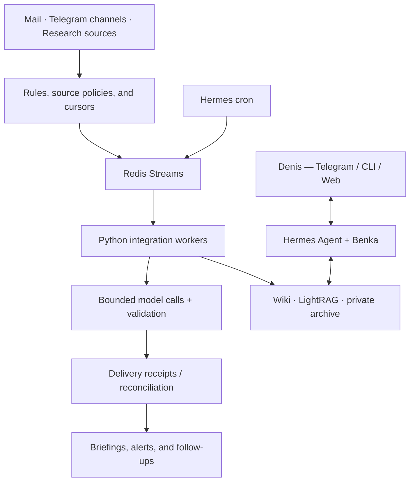

<p align="center">
  
</p>

<p align="center">
  <a href="LICENSE"></a>
  <a href="https://github.com/NousResearch/hermes-agent"></a>
  <a href="src/benka_integrations"></a>
  <a href="deploy/hermes"></a>
  <a href="#memory-that-improves-with-work"></a>
</p>

# My AI Office

**A self-hosted AI operating layer for a busy professional: it turns scattered messages, mail, research, and ideas into a clear view of what matters and what to do next.**

Designed and built by **[Denis Ermilov](https://github.com/eiler2005)**. My AI Office connects agent orchestration, asynchronous workflows, knowledge engineering, and production operations in one working system. Its everyday surface is Telegram, with CLI and an authenticated web dashboard for direct work.

## Meet Benka 🐾

**Benka is a miniature schnauzer — Denis's dog-shaped AI assistant and business co-pilot.** He is concise, sharp, warm when it helps, and deliberately unsentimental about weak ideas. His job is not to produce more chat. His job is to give Denis the right context, surface a decision, preserve the useful result, and help move the work forward.

Benka runs on [Hermes Agent](https://github.com/NousResearch/hermes-agent). The surrounding office is designed by Denis: the workflows, integrations, knowledge model, recovery logic, and deployment boundaries are implemented here.

<p align="center">
  <a href="#overview">Overview</a> ·
  <a href="#business-capabilities">Capabilities</a> ·
  <a href="#how-it-works">How it works</a> ·
  <a href="#memory-that-improves-with-work">Memory</a> ·
  <a href="#repository-structure">Repository</a> ·
  <a href="docs/engineering-case-study.md">Engineering case study</a>
</p>

## Overview

Most AI tools wait in a chat window for a prompt. My AI Office works continuously around the workday. It watches the sources Denis has chosen, filters routine noise with deterministic rules, uses models where language judgment helps, and delivers compact, source-linked outputs into the right Telegram conversation.

The result is a practical personal operating system for business and life:

- **Less monitoring work.** Important email, channel activity, market signals, and research do not depend on remembering to open every source.
- **Faster, better prepared decisions.** The office separates actionable items from reference information, retains original sources, and creates briefings that can be checked quickly.
- **Compounding knowledge.** Useful ideas, links, decisions, and research become editable memory instead of disappearing into chat history.
- **Control remains human.** Benka prepares, routes, summarizes, and reminds. Denis keeps approval for consequential actions and external communication.

The first version ran on OpenClaw. The current implementation moved the assistant runtime to Hermes while preserving the processing pipelines, state contracts, and migration/rollback discipline from the [predecessor](https://github.com/eiler2005/clawden-ai).

## Business capabilities

| Capability | What it does for the workday | How it is implemented |
| --- | --- | --- |
| **Inbox clarity** | Turns personal and work mail into briefings, separates actionable items from information, and preserves the original sender of a forwarded message. | [Email integration](artifacts/agentmail-email) |
| **Executive information radar** | Watches selected Telegram channels and research sources, balances categories, deduplicates repeats, and delivers concise digests with links to primary material. | [Telegram digest](artifacts/telethon-digest) |
| **Signals and opportunity watch** | Applies rules and source presets to surface relevant market, product, technology, or business signals without turning every input into an alert. | [Signals / Last30Days](artifacts/signals-bridge) |
| **Research that stays usable** | Captures a useful post, link, or thought into a source-backed wiki page; later promotion deepens the same chain instead of creating duplicates. | [Wiki tools](src/benka_integrations/wiki.py) |
| **Answers with context** | Uses curated knowledge, graph retrieval, and a private conversation archive to prepare grounded answers with traceable sources. | [Benka plugin](src/benka_integrations/plugin.py) |
| **Reliable recurring work** | Runs scheduled workflows once per slot, records confirmed deliveries, and sends uncertain outcomes to review instead of blindly retrying. | [Queue](src/benka_integrations/queue.py) · [Delivery](src/benka_integrations/delivery.py) |

### A day with the office

**Before work:** the office prepares mail and Telegram briefings, so Denis starts from the changes that require attention rather than from unread counts.

**During work:** Benka can answer a question from the curated knowledge base, turn a promising link into a durable research artifact, or help structure the next action. The `обсуди:` (“discuss”) prefix keeps a conversation from becoming an automatic save.

**Between meetings:** Signals and Last30Days workflows keep a watch on selected themes and sources. A failed source is isolated; it should not suppress the rest of the release.

**After work:** the useful conclusions survive as editable wiki pages and a compact profile, ready for the next conversation rather than trapped in an old chat.

## How it works



The flow has two complementary modes.

1. **Conversation:** Denis asks Benka in Telegram, CLI, or the dashboard. Hermes selects the configured interactive model route, Benka retrieves only relevant context, and the response returns to the same conversation.
2. **Background work:** Hermes cron puts a scheduled job into Redis. A dedicated worker collects material, applies deterministic processing, makes a restricted model call where needed, validates the output, and records the delivery result.

This separation keeps source-specific logic ordinary Python code and prevents the agent runtime from becoming a monolith. Model calls run with restricted context, limited tools, deadlines, validated output, and deterministic fallbacks. A delivery with an unknown result is not silently replayed.

## Memory that improves with work

Benka does not treat every message as permanent memory. The office uses separate layers, each for a different question.

| Layer | Purpose | Why it matters |
| --- | --- | --- |
| **Live state** | Running services, current jobs, and fresh source data | Current-state questions are checked against live systems rather than guessed from memory. |
| **Raw evidence** | Imported material, original sources, and searchable private transcripts | Preserves provenance and supports later verification without filling the assistant context. |
| **Curated wiki** | Decisions, research, entities, and idea chains in editable Markdown | This is the durable source of truth, compatible with Obsidian. |
| **LightRAG** | Graph-assisted retrieval over selected knowledge | Finds relevant context across the curated layer; it is a retrieval layer, not the only store. |
| **Hermes memory** | Compact stable facts and preferences | Helps conversations start with useful context without importing a lifetime of history. |

```text
source material → explicit capture → curated wiki → retrieval index → grounded answer
```

Whole mailboxes and ordinary Telegram conversation are not automatically indexed. Captures retain source metadata; the wiki artifact is created first, then indexing follows. This keeps personal, work, family, and sandbox contexts separately configured and makes the knowledge base explainable to its owner.

Read the [memory architecture](docs/architecture.md#knowledge-and-context) and [engineering case study](docs/engineering-case-study.md#4-separate-knowledge-from-accumulated-data) for the operational tradeoffs.

## Engineering choices

| Decision | Practical benefit | Inspect the work |
| --- | --- | --- |
| **Keep orchestration separate from domain logic** | Source parsers, scorers, and renderers can evolve without replacing the agent runtime. | [Integration package](src/benka_integrations) |
| **Treat uncertainty as a state** | Slot deduplication, delivery receipts, and reconciliation create a recovery path for interrupted work. | [Queue](src/benka_integrations/queue.py) · [Delivery](src/benka_integrations/delivery.py) |
| **Bound model work** | Background tasks use fresh Hermes homes, restricted tools, provider chains, output validation, and deterministic fallbacks. | [Model runner](src/benka_integrations/model_child.py) |
| **Make privacy structural** | Public code is separate from credentials, source bindings, mail, personal notes, sessions, and live databases. | [Deployment templates](deploy/hermes) · [Architecture](docs/architecture.md) |
| **Design migration and rollback together** | Cold snapshots, staged restore, import reports, and state reconciliation make runtime replacement reviewable. | [Migration tooling](src/benka_integrations/migration.py) · [Runbook](docs/hermes/cutover-rollback.md) |

## Stack

| Layer | Technologies |
| --- | --- |
| Agent & interfaces | Hermes Agent, native Benka plugin, Telegram, CLI, Hermes web dashboard |
| Integration runtime | Python 3.12, source-specific pipelines, isolated model subprocesses |
| Scheduling & recovery | Hermes cron, Redis Streams, worker state, delivery receipts |
| Knowledge | Obsidian-compatible Markdown wiki, `wiki-import`, LightRAG, SQLite FTS archive |
| Model access | OpenAI for the main assistant; configurable fallback chains including Qwen and DeepSeek; OmniRoute for assigned workloads |
| Deployment | Docker Compose, pinned Hermes source and dependencies, Caddy, TLS/mTLS, persistent volumes |

Model selection is configured per workload. Interactive and auxiliary tasks have separate settings, while background integrations use their own provider chains. [Model execution details](docs/architecture.md#model-execution) describe the boundary.

## Repository structure

```text
.
├── src/benka_integrations/   Benka plugin, workers, models, queue, delivery, migration
├── artifacts/                Email, digest, Signals, Last30Days, and wiki processing
├── deploy/hermes/            Container definitions and sanitized deployment templates
├── plugins/benka/            Hermes plugin manifest
├── skills/                   Benka workflow skills
├── workspace/                Persona, Telegram policy, memory index, and tool contracts
├── scripts/                  Packaging, inventory, import, verification, and operations
├── docs/hermes/              Acceptance evidence, cutover, rollback, and runbooks
├── docs/architecture.md      System boundaries and data flow
└── vendor/hermes-agent/      Pinned upstream Hermes Agent submodule
```

To obtain the source and pinned runtime on an isolated VPS:

```bash
git clone --recurse-submodules https://github.com/eiler2005/my-ai-office.git
cd my-ai-office
```

Continue with the [operations runbook](docs/hermes/operations.md) for container builds and private deployment configuration.

## Deployment status & evidence

**Recorded status, 6 September 2026: `ACTIVE_ON_HERMES`.** The production switch used a fresh cold snapshot on the Hermes VPS. The former OpenClaw server's Docker services were stopped, and its state was retained for rollback. The [cutover record](docs/hermes/cutover-record-2026-09-06.md) documents the operation.

The [VPS rehearsal record](docs/hermes/acceptance.md) reports **209 passing regression checks**, native Hermes contract checks, Redis persistence/recovery checks, and authenticated dashboard checks. Results are tied to the candidate and scope documented there. The required 48-hour observation and full production acceptance remain open in that record.

Builds and runtime verification run on the VPS. This project does not use GitHub Actions for deployment or application testing.

## Public code, private office

The repository contains integration code, sanitized templates, architecture, and operational records. Credentials, OAuth state, Telegram sessions, personal notes, mail, conversation archives, live databases, and certificates stay outside Git. Self-hosted state does not imply offline operation: configured model providers and source APIs receive requests from their respective workflows.

## Author & credits

**[Denis Ermilov](https://github.com/eiler2005)** — system design, workflow integration, knowledge architecture, and deployment engineering.

Built on [Hermes Agent](https://github.com/NousResearch/hermes-agent), [LightRAG](https://github.com/HKUDS/LightRAG), [Redis](https://github.com/redis/redis), and [Telethon](https://github.com/LonamiWebs/Telethon). The integration layer and operating design are the focus of this repository; upstream components retain their own authorship and licenses.

[MIT license](LICENSE).
