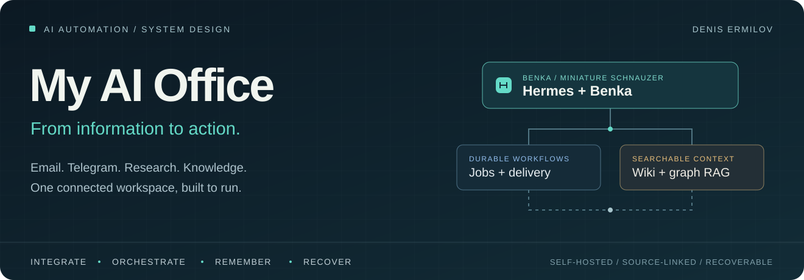
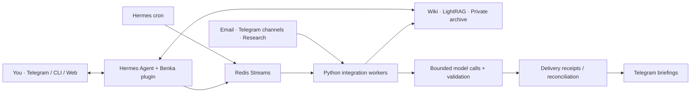

<p align="center">
  
</p>

<p align="center">
  <a href="LICENSE"></a>
  <a href="https://github.com/NousResearch/hermes-agent"></a>
  <a href="src/benka_integrations"></a>
  <a href="deploy/hermes"></a>
  <a href="docs/architecture.md"></a>
</p>

# My AI Office

**A personal AI office that turns email, Telegram, research, and saved ideas into useful context and daily briefings.**

Designed and built by **[Denis Ermilov](https://github.com/eiler2005)**. My AI Office brings together agent orchestration, asynchronous workflows, knowledge engineering, and self-hosted operations in one working system. Its assistant, **Benka**, runs on [Hermes Agent](https://github.com/NousResearch/hermes-agent); Telegram is the everyday interface, with CLI and an authenticated web dashboard for direct access.

The engineering work lives around the conversation: deciding what deserves attention, preserving where information came from, recovering interrupted jobs, and keeping delivery and persistent state under control.

<p align="center">
  <a href="#what-the-office-does">Capabilities</a> ·
  <a href="docs/architecture.md">Architecture</a> ·
  <a href="docs/engineering-case-study.md">Engineering case study</a> ·
  <a href="docs/hermes/operations.md">Operations</a>
</p>

## What the office does

| Workflow | Useful result | Implementation |
| --- | --- | --- |
| **Inbox triage** | Personal and work mail become separate briefings, with actionable items distinguished from information and forwarded messages attributed to their original sender. | [Email integration](artifacts/agentmail-email) |
| **Telegram intelligence** | Selected channels become a digest with category balance, preserved source links, and cursors that track what has already been processed. | [Digest pipeline](artifacts/telethon-digest) |
| **Signals & research** | Rules, source presets, and deduplication turn incoming material into alerts and Last30Days research runs. | [Signals / Last30Days](artifacts/signals-bridge) |
| **Knowledge & ideas** | Explicit captures create wiki pages; idea promotion follows the existing chain instead of creating a second copy. | [Wiki tools](src/benka_integrations/wiki.py) |
| **Grounded recall** | The assistant consults curated knowledge, uses LightRAG for retrieval, and searches a private archive of earlier conversations with source references. | [Hermes tools](src/benka_integrations/plugin.py) |
| **Recurring work** | A single scheduler hands jobs to Redis workers; deliveries carry receipts, and uncertain outcomes go to reconciliation. | [Queue](src/benka_integrations/queue.py) · [Delivery](src/benka_integrations/delivery.py) |

### Three everyday examples

**An email arrives.** The inbox workflow identifies the original sender, applies filters and triage, and includes the result in the appropriate briefing. Full mailboxes are not indexed into the knowledge base by default.

**A useful idea appears in Telegram.** An explicit capture preserves the source and creates a wiki artifact. Later promotion updates the idea's chain. The `обсуди:` (“discuss”) convention keeps a conversation from becoming an automatic save.

**A digest is due.** Hermes cron enqueues a job for its time slot. A worker collects and scores material, validates model output, and prepares a linked digest. If a send has an unknown outcome, the system records it for review rather than sending the same publication again automatically.

## How it fits together



**Hermes handles the agent runtime.** The project adds native tools, workflow adapters, source processing, persistence, delivery controls, and migration tooling. Existing processing algorithms were carried forward from the [OpenClaw predecessor](https://github.com/eiler2005/clawden-ai).

| Engineering decision | Why it matters | Inspect the work |
| --- | --- | --- |
| **Separate orchestration from processing** | Source-specific parsing and scoring remain ordinary Python code; changing the agent runtime does not require rewriting each workflow. | [Integration package](src/benka_integrations) |
| **Make model work bounded** | Background calls use a fresh Hermes context, restricted tools, deadlines, output validation, and deterministic fallbacks. | [Model runner](src/benka_integrations/model_child.py) · [Adapter](src/benka_integrations/models.py) |
| **Treat uncertainty as a state** | Slot deduplication, confirmed delivery IDs, and reconciliation give interrupted jobs an explicit recovery path. | [Queue](src/benka_integrations/queue.py) · [Delivery](src/benka_integrations/delivery.py) |
| **Keep knowledge portable** | Markdown wiki pages remain the durable knowledge store; graph retrieval and conversation search serve distinct purposes. | [Knowledge architecture](docs/architecture.md#knowledge-and-context) |
| **Design the migration and the rollback** | Verified cold snapshots, safe restore, import reports, and state reconciliation support a controlled runtime replacement. | [Migration tooling](src/benka_integrations/migration.py) · [Cutover runbook](docs/hermes/cutover-rollback.md) |

For the problem, tradeoffs, and verification evidence behind these choices, read the **[engineering case study](docs/engineering-case-study.md)**.

## Stack

| Layer | Technologies |
| --- | --- |
| Agent & interfaces | Hermes Agent, native Benka plugin, Telegram, CLI, Hermes web dashboard |
| Integration runtime | Python 3.12, source-specific pipelines, isolated model subprocesses |
| Scheduling & recovery | Hermes cron, Redis Streams, worker state, delivery receipts |
| Knowledge | Obsidian-compatible Markdown wiki, `wiki-import`, LightRAG, SQLite FTS archive |
| Model access | OpenAI for the main assistant; configurable routes and fallback chains, including Qwen and DeepSeek; OmniRoute for routed workloads |
| Deployment | Docker Compose, pinned Hermes source and dependencies, Caddy, TLS/mTLS, persistent volumes |

Model selection is configured per workload. Interactive and auxiliary tasks have separate settings; background integrations use their own provider chains. See [model execution](docs/architecture.md#model-execution) for the boundaries.

## Deployment status & evidence

**Recorded status, 6 September 2026: `ACTIVE_ON_HERMES`.** The production switch used a fresh cold snapshot on the Hermes VPS. The former OpenClaw server's Docker services were stopped, and its state was retained for rollback. The [cutover record](docs/hermes/cutover-record-2026-09-06.md) documents the operation.

The [VPS rehearsal record](docs/hermes/acceptance.md) reports **209 passing regression checks**, native Hermes contract checks, Redis persistence/recovery checks, and authenticated dashboard checks. Results are tied to the candidate and scope documented there. The required 48-hour observation and full production acceptance remain open in that record.

Builds and runtime verification run on the VPS. This project does not use GitHub Actions for deployment or application testing.

## Explore the project

```text
src/benka_integrations/   Native tools, workers, models, queues, delivery, migration
artifacts/               Email, digest, Signals, Last30Days, and wiki processing
deploy/hermes/           Container definitions and sanitized deployment templates
scripts/                 Packaging, inventory, import, verification, and operations
docs/hermes/             Acceptance evidence, cutover, rollback, and runbooks
vendor/hermes-agent/     Pinned upstream Hermes Agent submodule
```

To obtain the source and pinned runtime on your VPS:

```bash
git clone --recurse-submodules https://github.com/eiler2005/my-ai-office.git
cd my-ai-office
```

Continue with the [operations runbook](docs/hermes/operations.md) for isolated container builds and configuration.

| Start here | Then explore |
| --- | --- |
| **Understand the design** | [Architecture](docs/architecture.md) · [Engineering case study](docs/engineering-case-study.md) |
| **Inspect the implementation** | [Python package](src/benka_integrations) · [Hermes plugin](src/benka_integrations/plugin.py) · [Deployment](deploy/hermes) |
| **Reproduce on an isolated VPS** | [Operations and build instructions](docs/hermes/operations.md) · [Verification record](docs/hermes/acceptance.md) |
| **Follow the runtime migration** | [Plan](docs/25-hermes-migration-plan.md) · [Inventory](docs/hermes/inventory.md) · [Drift log](docs/hermes/drift-log.md) · [Cutover & rollback](docs/hermes/cutover-rollback.md) |
| **Operate the dashboard** | [Panel runbook](docs/hermes/panel.md) |
| **Trace the project's evolution** | [Changelog](CHANGELOG.md) · [Historical OpenClaw overview](README.openclaw.md) · [Original office concept](README.office.md) |

This is a reference implementation with deployment tooling. Running your own instance requires private source bindings, credentials, and a deployment manifest; production activation is an explicit operator step.

## Public code, private office

The repository contains integration code, sanitized templates, architecture, and operational records. Credentials, OAuth state, Telegram sessions, personal notes, mail, conversation archives, live databases, and certificates stay outside Git. Self-hosted state does not imply offline operation: configured model providers and source APIs receive requests from their respective workflows.

## Author & credits

**[Denis Ermilov](https://github.com/eiler2005)** — system design, workflow integration, knowledge architecture, and deployment engineering.

This project shows my approach to AI automation: connect useful workflows end to end, keep their state understandable, and make failure and recovery part of the implementation.

Built on [Hermes Agent](https://github.com/NousResearch/hermes-agent), [LightRAG](https://github.com/HKUDS/LightRAG), [Redis](https://github.com/redis/redis), and [Telethon](https://github.com/LonamiWebs/Telethon), with the broader stack documented above. The integration layer and operating design are the focus of this repository; upstream components retain their own authorship and licenses.

[MIT license](LICENSE).
