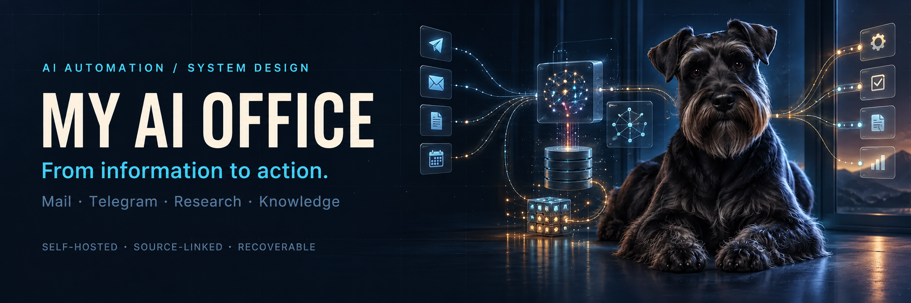
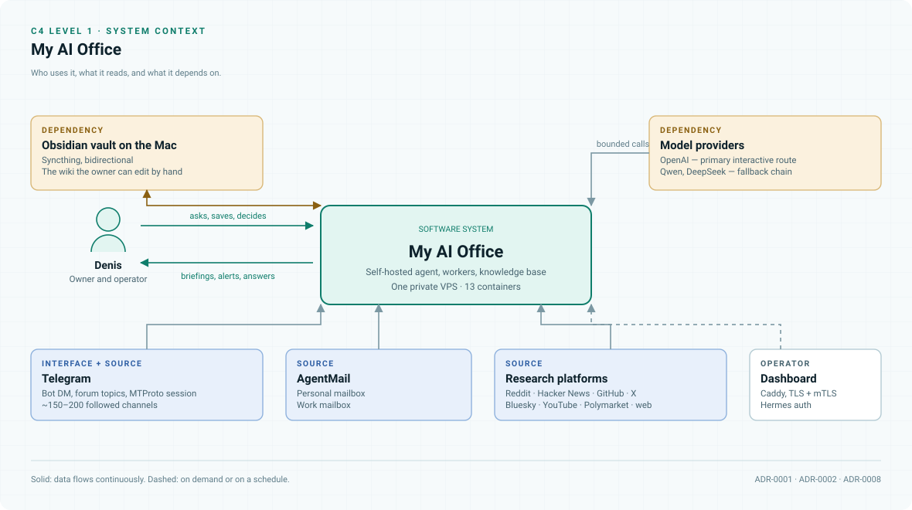
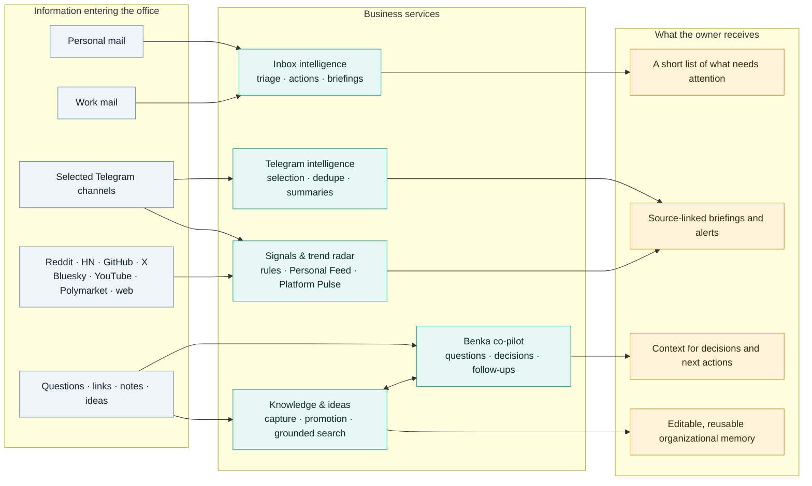
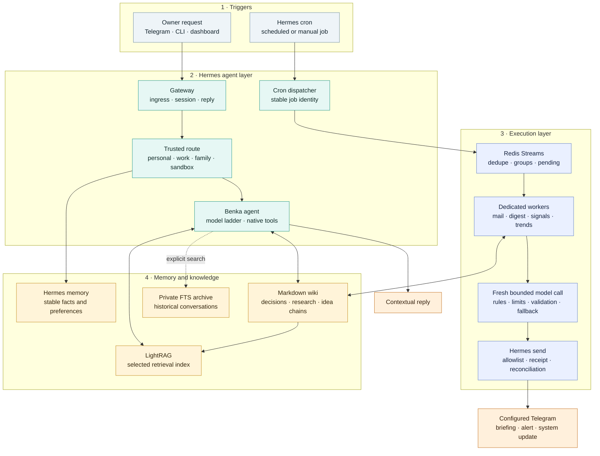
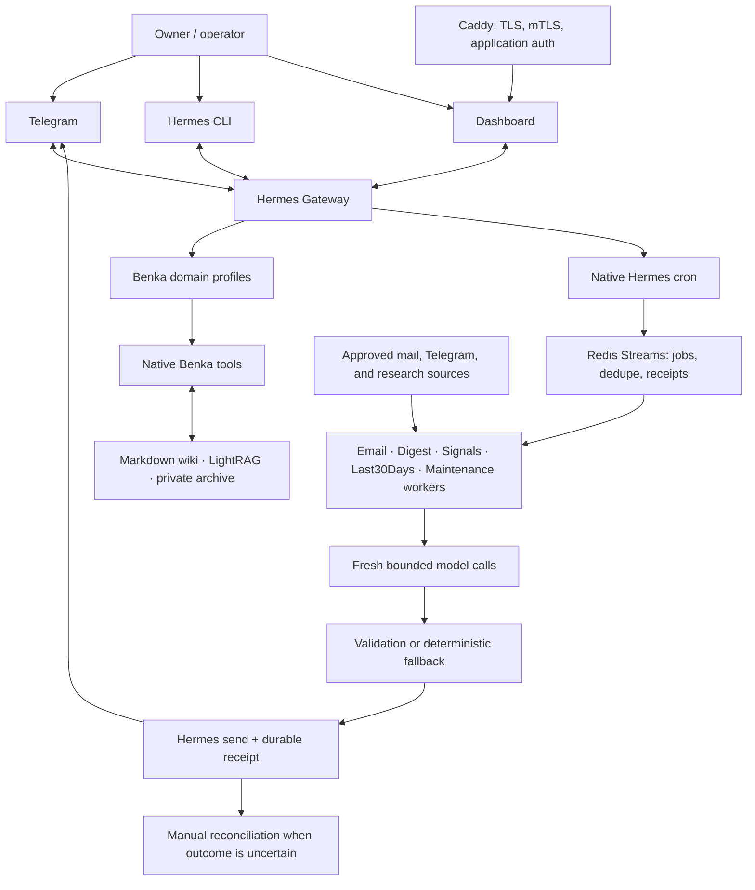

<p align="center">
  
</p>

<p align="center">
  <a href=".github/workflows/secret-scan.yml"></a>
  <a href=".github/workflows/docs.yml"></a>
  <a href="LICENSE"></a>
</p>

<p align="center">
  <a href="https://github.com/NousResearch/hermes-agent"></a>
  <a href="src/benka_integrations"></a>
  <a href="deploy/hermes"></a>
  <a href="docs/adr/"></a>
  <a href="#memory-that-improves-with-work"></a>
</p>

# My AI Office

**A self-hosted AI operating layer for a busy professional. It turns mail, Telegram, research, and saved knowledge into source-linked briefings, decisions, and next actions.**

Designed and built by **[Denis Ermilov](https://github.com/eiler2005)**. My AI Office connects agent orchestration, asynchronous workflows, knowledge engineering, and production operations in one working system. Telegram is its everyday surface; the Hermes CLI and authenticated web dashboard support direct operator work.

## Meet Benka 🐾

**Benka is a black miniature schnauzer — Denis's dog and the office's AI co-pilot.** He is concise, sharp, warm when it helps, and deliberately unsentimental about weak ideas. His job is to give Denis the right context, surface a decision, preserve the useful result, and help move the work forward.

Benka runs on [Hermes Agent](https://github.com/NousResearch/hermes-agent). The surrounding office is designed by Denis: the workflows, integrations, knowledge model, recovery logic, and deployment boundaries are implemented here.

## At a glance

| | |
| --- | --- |
| **In production since** | 6 September 2026 — status `ACTIVE_ON_HERMES`, [observation window still open](docs/hermes/acceptance.md) |
| **Deployment** | 13 containers, one private VPS, one published port |
| **Background workers** | 6, each with its own manifest, cursor, consumer group, and delivery route |
| **Sources** | 2 mailboxes · ~150–200 Telegram channels · 7 research platforms |
| **Surfaces** | 12 purpose-specific Telegram destinations, plus CLI and a dashboard |
| **Verification** | 209 checks recorded at cutover on the VPS · 21 test modules |
| **Decisions on record** | [12 ADRs](docs/adr/) with alternatives and costs |

<picture>
  <source media="(prefers-color-scheme: dark)" srcset="docs/assets/c4-context-dark.svg">
  
</picture>

**New here?** The [documentation map](docs/README.md) routes by what you are trying to do. If you are
evaluating this as engineering work, start with the
[engineering case study](docs/engineering-case-study.md) and the [decision records](docs/adr/).

## Table of contents

- [At a glance](#at-a-glance)
- [Overview](#overview)
- [Business layer](#business-layer)
- [How Hermes runs the office](#how-hermes-runs-the-office)
- [Architecture](#architecture)
- [Services](#services)
- [Source integrations and VPS boundary](#source-integrations-and-vps-boundary)
- [Telegram surfaces](#telegram-surfaces)
- [Model routing](#model-routing)
- [Memory that improves with work](#memory-that-improves-with-work)
- [Engineering choices](#engineering-choices)
- [Stack](#stack)
- [Repository structure](#repository-structure)
- [Documentation](#documentation)
- [Security](#security)
- [Deployment status & evidence](#deployment-status--evidence)
- [Engineering case study](docs/engineering-case-study.md)

## Overview

Most AI tools wait in a chat window for a prompt. My AI Office works continuously around the workday. It watches the sources Denis has chosen, filters routine noise with deterministic rules, uses models where language judgment helps, and delivers compact, source-linked outputs into the right Telegram conversation.

The result is a practical personal operating system for business and life:

- **Less monitoring work.** Important email, channel activity, market signals, and research do not depend on remembering to open every source.
- **Faster, better prepared decisions.** The office separates actionable items from reference information, retains original sources, and creates briefings that can be checked quickly.
- **Compounding knowledge.** Useful ideas, links, decisions, and research become editable memory instead of disappearing into chat history.
- **Control remains human.** Benka prepares, routes, summarizes, and reminds. Denis keeps approval for consequential actions and external communication.

The first version ran on a different agent runtime. Moving to Hermes preserved the processing pipelines and state contracts intact — which was the point of keeping the business logic out of the runtime in the first place ([ADR-0004](docs/adr/0004-separate-orchestration-from-domain-logic.md)). The [predecessor repository](https://github.com/eiler2005/clawden-ai) is frozen; the migration is recorded in [ADR-0009](docs/adr/0009-migrate-runtime-to-hermes.md).

## Business layer

The office is organized around work outcomes rather than around containers. Personal and work communication stay separate, information is compressed before it reaches the owner, and anything worth keeping can become searchable knowledge.



### Capability map

| Business area | Capability | Input | Result |
| --- | --- | --- | --- |
| **Communication** | Personal inbox | Personal AgentMail mailbox | Deduplicated mini-batches and scheduled summaries that separate actions from reference mail. |
| **Communication** | Work inbox | Work mailbox, including forwarded messages | Work briefings with the original sender resolved and actionable/informational triage preserved. |
| **Communication** | Telegram intelligence | An approved catalog of Telegram channels and folders | Balanced, source-linked digests with repeated material removed. |
| **Intelligence** | Signals | Configured mail and Telegram event rules | Small, timely alerts for matched subjects without forwarding every source event. |
| **Intelligence** | Last30Days research | Reddit, Hacker News, GitHub, X, Bluesky, YouTube, Polymarket, and web discovery | `Personal Feed` and `Platform Pulse` reports; one failed source does not discard the rest of a run. |
| **Direct work** | Benka co-pilot | Telegram DM, Hermes CLI, or the protected dashboard | Contextual answers, critique, follow-ups, and help turning information into a decision or next action. |
| **Knowledge** | Knowledge capture | A link, forwarded post, document, or explicit save request | A source-backed Markdown wiki artifact followed by retrieval indexing. |
| **Knowledge** | Idea lifecycle | Early thoughts and fragments | Lightweight idea capture, then explicit promotion into the existing research chain without duplicates. |
| **Knowledge** | Grounded search | A question in the Knowledge surface | Relevant wiki and LightRAG references opened before a source-linked answer is composed. |
| **Knowledge** | Historical recall | An explicit archive query | Searchable excerpts from imported conversations and diaries without loading the full archive into a live session. |
| **Control** | Domain separation | Personal, work, family, or sandbox route | Different tools, files, memory, source bindings, and delivery destinations for each context. |
| **Reliability** | Scheduled delivery and recovery | Hermes cron or an approved manual run | One logical run per slot, confirmed Telegram receipts, and operator review for uncertain outcomes. |

### A day with the office

**Before work:** the office prepares mail and Telegram briefings, so Denis starts from the changes that require attention rather than from unread counts.

**During work:** Benka can answer a question from the curated knowledge base, turn a promising link into a durable research artifact, or help structure the next action. The `обсуди:` (“discuss”) prefix keeps a conversation from becoming an automatic save.

**Between meetings:** Signals and Last30Days workflows keep a watch on selected themes and sources. A failed source is isolated; it should not suppress the rest of the release.

**After work:** the useful conclusions survive as editable wiki pages and a compact profile, ready for the next conversation rather than trapped in an old chat.

## How Hermes runs the office

Hermes is the agent orchestration layer. It owns the human interfaces, trusted profile routing, interactive agent sessions, native tools, model selection, and the cron schedule. The business algorithms remain in dedicated Python integrations, while Redis and the knowledge services hold durable state.



There are two execution paths:

1. **Interactive path.** A trusted message reaches the Gateway. Hermes selects the `personal`, `work`, `family`, or `sandbox` profile, assembles only that profile's permitted context, chooses the configured model tier, and exposes the allowed Benka tools. A knowledge question can search LightRAG and open source pages; an explicit save creates the wiki artifact before indexing it.
2. **Background path.** Hermes cron derives a stable identity for the time slot and enqueues a small job in Redis. A dedicated worker fetches the source, advances its cursor, applies deterministic filters, and uses a fresh isolated agent call only where language judgment is useful. The result is validated, persisted, and sent through an allowlisted Telegram route.

Hermes therefore orchestrates the work without absorbing every business rule into the agent prompt. The Gateway handles conversations and profiles; cron decides *when* work starts; Redis records *which* run owns a slot; workers define *how* each source is processed; memory and knowledge services decide *what context can be reused*; delivery receipts establish *whether an external message was confirmed*.

### Business rhythm

The production rhythm is expressed as native Hermes cron jobs in `Europe/Moscow`. Private deployment manifests remain the operational source of truth for the exact enabled jobs and times.

| Workflow | Production rhythm | What Hermes starts |
| --- | --- | --- |
| Benka conversation | On every trusted owner request | An interactive session with the routed profile, permitted context, native tools, and the configured model tier. |
| Mailbox polling | Personal and work inboxes every five minutes | Independent polling jobs with separate streams, cursors, and consumer groups. |
| Signals | Every five minutes | Rule evaluation over enabled mail and Telegram sources. |
| Telegram Digest | 08:00, 11:00, 14:00, 17:00, and 21:00 | A scheduled digest run with its slot and digest type preserved. |
| Personal mail briefing | 08:00, 13:00, 16:00, and 20:00 | Personal morning/interval/editorial summaries. |
| Work mail briefing | Eight slots between 08:30 and 19:00 | Work-only summaries with forwarded-sender resolution and triage. |
| Last30Days | 07:00 | The enabled research preset; the second preset remains available on request. |
| LightRAG refresh | Every 30 minutes | Indexing of explicitly allowed knowledge roots. |
| Wiki maintenance | Daily and weekly jobs | Reports, lifecycle updates, archive work, and overview/topic refresh according to the job action. |

Every scheduled path follows the same control loop:

```text
cron slot → stable run ID → Redis stream → dedicated worker → validated artifact
          → allowlisted delivery → confirmed message ID
                                  ↘ uncertain outcome → reconciliation queue
```

## Architecture

One private VPS runs the office as a Docker Compose project. Telegram is the everyday entrance; CLI and a protected web dashboard provide operator access. The runtime owns conversation routing and cron, while ordinary Python workers own source-specific processing.

```text
Owner / operator
 ├─ Telegram ───────────────────────────────┐
 ├─ Hermes CLI ─────────────────────────────┼─► Hermes Gateway ─► Benka profiles + native tools
 └─ Caddy + mTLS + dashboard ───────────────┘           │
                                                         ├─► Wiki / LightRAG / private archive
Hermes cron ─► Redis Streams ─► dedicated workers ──────┤
Approved mail, Telegram and research sources ───────────┤
                                                         └─► Hermes send ─► configured Telegram routes

Every worker: collect → apply rules → bounded model call → validate → receipt or reconciliation
```



The queue is the handoff between scheduling and work. A slot receives one stable run identifier, a worker processes it through a consumer group, and delivery stores a receipt only after Telegram returns a message identifier. Redis can make the internal handoff durable; it cannot prove a remote side effect by itself, so ambiguous outcomes require verification before recovery.

## Services

The production [`benka-hermes`](deploy/hermes/compose.production.yaml) Compose project defines **13 containers**. The names below match the deployment file, so the public architecture can be compared directly with runtime inventory.

| Compose service | Role | State and integration boundary |
| --- | --- | --- |
| `gateway` | Hermes Gateway: Telegram polling, profile routing, native tools, interactive sessions, and cron ownership | The only production Telegram polling owner; mounts reviewed profiles, schedules, read-only vault data, and its own Hermes state. |
| `dashboard` | Separate Hermes browser UI | Shares the Gateway state required for sessions, but runs as a distinct process behind Caddy. |
| `caddy` | TLS reverse proxy for the dashboard | The only office container with a published listener; applies mTLS before Hermes authentication. |
| `redis` | **Integration bus**: streams, consumer groups, slot dedupe, job state, delivery receipts, and reconciliation | Persistent AOF-backed internal service; it schedules or records work but never publishes Telegram messages itself. |
| `omniroute` | Provider routing retained for explicitly assigned workloads | Keeps separate provider/OAuth state; it is not the universal route for every Hermes call. |
| `lightrag` | Graph-assisted retrieval over selected knowledge | Reads the approved personal vault input and keeps independent graph/vector/KV state. |
| `wiki` | Wiki ingestion and query service | Writes source-backed Markdown first and then asks LightRAG to index selected artifacts. |
| `worker-email-personal` | Personal mailbox polling, classification, dedupe, and digest generation | Own manifest, config, cursor state, Redis group, and Telegram delivery allowlist. |
| `worker-email-work` | Work mailbox polling, forwarded-sender resolution, triage, and digests | Isolated from the personal mailbox by manifest, config, state, stream, and consumer group. |
| `worker-telegram` | Telethon channel reading, scoring, dedupe, digest rendering, persistence, and delivery | Uses an approved channel catalog and private Telethon session; deliveries require confirmed receipts. |
| `worker-signals` | Rule-based monitoring of configured mail and Telegram sources | Runs frequent small checks and publishes only matched, configured signals. |
| `worker-last30days` | Personal Feed / Platform Pulse research across Reddit and other configured platforms | Uses the Signals codebase with independent jobs and state; source failures are recorded per source. |
| `worker-maintenance` | Wiki lifecycle and LightRAG maintenance | Receives only maintenance operations and the data mounts needed for them. |

### Where the integration bus lives

The Hermes deployment does not run a second container named `integration-bus`. The integration bus is the `redis` service plus the scheduling, queue, delivery, and worker contracts in [`src/benka_integrations`](src/benka_integrations):

```text
Hermes cron
  └─► Redis Streams
       ├─► ingest:jobs:email:personal ─► worker-email-personal
       ├─► ingest:jobs:email:work     ─► worker-email-work
       ├─► ingest:jobs:telegram       ─► worker-telegram
       ├─► ingest:jobs:signals        ─► worker-signals
       ├─► ingest:jobs:last30days     ─► worker-last30days
       └─► benka:maintenance:personal ─► worker-maintenance

Confirmed work ─► job state / delivery receipt
Unknown outcome ─► benka:reconcile ─► operator review
```

[`artifacts/integration-bus`](artifacts/integration-bus) preserves the predecessor's standalone Redis Compose artifact for history and migration compatibility. Production Hermes owns Redis through [`compose.production.yaml`](deploy/hermes/compose.production.yaml), so starting the historical artifact as another bus would create two competing state planes.

## Source integrations and VPS boundary

Containers, source adapters, and neighboring VPS projects are deliberately different concepts:

| Layer | Included systems | Meaning |
| --- | --- | --- |
| **My AI Office containers** | The 13 `benka-hermes` services above | Deployed and operated by this repository as one isolated Compose project. |
| **External source integrations** | AgentMail mailboxes, selected Telegram channels, Reddit, Hacker News, GitHub, X, Bluesky, YouTube, Polymarket, and general web results | Remote data sources used by a worker when enabled in its private deployment configuration; they are not local containers. |
| **Neighboring VPS projects** | `reddit-compass`, `moex-futoi`, `cheap-intelligence`, and `stealth` | Independent Compose projects sharing the host. They are neither dependencies nor workers of My AI Office and are kept outside its networks and lifecycle commands. |

`Reddit` and `reddit-compass` are unrelated in the topology. **Reddit** is an external Last30Days source. Its adapter uses native JSON/RSS discovery with an optional configured backup and lives under [`signals-bridge/last30days_patches`](artifacts/signals-bridge/last30days_patches). **Reddit Compass** is a separate application on the same VPS; My AI Office reuses only established host access and adjacent infrastructure conventions, not its application container or data.

| Source family | Consuming workflow | Repository implementation |
| --- | --- | --- |
| Personal and work mail | Email polling, actionable/informational triage, scheduled digests | [`artifacts/agentmail-email`](artifacts/agentmail-email) |
| Selected Telegram channels | Scheduled Telegram Digest | [`artifacts/telethon-digest`](artifacts/telethon-digest) |
| Email and Telegram event sources | Signals rules and mini-batches | [`artifacts/signals-bridge`](artifacts/signals-bridge) |
| Reddit | Last30Days native JSON/RSS hybrid path; optional backup when configured | [`reddit_hybrid.py`](artifacts/signals-bridge/last30days_patches/reddit_hybrid.py) |
| Hacker News | Last30Days companion discovery through the public Algolia API | [`last30days_runner.py`](artifacts/signals-bridge/last30days_runner.py) |
| GitHub, X, Bluesky, YouTube, Polymarket, web | Last30Days source bundle, enabled per private preset and credentials | [`config.example.json`](artifacts/signals-bridge/config.example.json) |

## Telegram surfaces

Telegram is a set of purpose-specific surfaces rather than one unrestricted bot chat. The Gateway maps trusted users and configured routes to a `personal`, `work`, `family`, or `sandbox` profile before tools receive a request.

| Surface | What happens there | Guardrails |
| --- | --- | --- |
| **Owner DM** | Benka's primary dialogue, follow-ups, and home channel for system notifications | A production home channel is derived only from one trusted personal owner. Consequential actions still require approval. |
| **Operations forum** | Routed topics for inbox, tasks, approvals, system status, research, and reports | A worker may publish only to its configured allowlisted route; it cannot choose a chat or topic from source content. |
| **Personal and work mail** | Short triage notices and scheduled briefings | Full raw emails are not posted or indexed by default. Personal and work state remain separate. |
| **Telegram Digest** | Source-linked, scheduled intelligence briefings from selected channels | Source folders, cursors, category balance, delivery destination, and receipt handling are explicit configuration. |
| **Signals / Last30Days** | Important alerts and research outputs | A single failed source does not suppress the rest of the run. No broadcast happens without a configured route. |
| **Knowledge and Ideas** | Save a link, post, or thought as a structured wiki artifact; search grounded knowledge | `обсуди:` keeps a message in discussion and prevents automatic saving. Promotion extends an existing idea chain instead of duplicating it. |
| **Family and sandbox** | Restricted family conversations and a test-only workspace | Family long-term memory requires explicit approval. Sandbox data never writes into production memory without an explicit promotion. |

## Model routing

OpenAI is the primary interactive route. Qwen and DeepSeek are resilience fallbacks, not a silent replacement for the main assistant. Each background workflow has its own bounded provider chain, because summarising a digest and holding a personal conversation are different jobs.

| Task | Primary route | Execution rule |
| --- | --- | --- |
| Auxiliary work | `gpt-5.6-luna` | Minimal or low reasoning for small transformations and review. |
| Everyday dialogue | `gpt-5.6-terra` | Medium reasoning for Benka's normal conversation. |
| Complex multi-step work | One `gpt-5.6-sol` delegation, then Terra reviews and combines it | The delegated agent has no terminal, browser, filesystem, personal memory, or further delegation. |
| OpenAI route unavailable | `qwen3.7-flash`, then `deepseek-v4-flash` | Used only as the configured fallback chain; output remains validated. |
| Background integrations | Per-worker provider routes or assigned OmniRoute workload | Fresh Hermes home, no personal memory/context files, restricted tools, bounded time/tokens/turns, and deterministic fallback where available. |

## Memory that improves with work

Benka does not treat every message as permanent memory. The office uses separate layers, each for a different question.

| Layer | Purpose | Why it matters |
| --- | --- | --- |
| **Live state** | Running services, current jobs, and fresh source data | Current-state questions are checked against live systems rather than guessed from memory. |
| **Raw evidence** | Imported material, original sources, and searchable private transcripts | Preserves provenance and supports later verification without filling the assistant context. |
| **Curated wiki** | Decisions, research, entities, and idea chains in editable Markdown | This is the durable source of truth, compatible with Obsidian. |
| **LightRAG** | Graph-assisted retrieval over selected knowledge | Finds relevant context across the curated layer; it is a retrieval layer, not the only store. |
| **Hermes memory** | Compact stable facts and preferences | Helps conversations start with useful context without importing a lifetime of history. |

```text
source material → explicit capture → curated wiki → retrieval index → grounded answer
```

Whole mailboxes and ordinary Telegram conversation are not automatically indexed. Captures retain source metadata; the wiki artifact is created first, then indexing follows. This keeps personal, work, family, and sandbox contexts separately configured and makes the knowledge base explainable to its owner.

Read the [memory architecture](docs/architecture.md#knowledge-and-context) and [engineering case study](docs/engineering-case-study.md#4-separate-knowledge-from-accumulated-data) for the operational tradeoffs.

## Engineering choices

| Decision | Practical benefit | Inspect the work |
| --- | --- | --- |
| **Keep orchestration separate from domain logic** | Source parsers, scorers, and renderers can evolve without replacing the agent runtime. | [Integration package](src/benka_integrations) |
| **Treat uncertainty as a state** | Slot deduplication, delivery receipts, and reconciliation create a recovery path for interrupted work. | [Queue](src/benka_integrations/queue.py) · [Delivery](src/benka_integrations/delivery.py) |
| **Bound model work** | Background tasks use fresh Hermes homes, restricted tools, provider chains, output validation, and deterministic fallbacks. | [Model runner](src/benka_integrations/model_child.py) |
| **Make privacy structural** | Public code is separate from credentials, source bindings, mail, personal notes, sessions, and live databases. | [Deployment templates](deploy/hermes) · [Architecture](docs/architecture.md) |
| **Design migration and rollback together** | Cold snapshots, staged restore, import reports, and state reconciliation make runtime replacement reviewable. | [Migration tooling](src/benka_integrations/migration.py) · [Runbook](docs/hermes/cutover-rollback.md) |

## Stack

| Layer | Technologies |
| --- | --- |
| Agent & interfaces | Hermes Agent, native Benka plugin, Telegram, CLI, Hermes web dashboard |
| Integration runtime | Python 3.12, source-specific pipelines, isolated model subprocesses |
| Scheduling & recovery | Hermes cron, Redis Streams, worker state, delivery receipts |
| Knowledge | Obsidian-compatible Markdown wiki, `wiki-import`, LightRAG, SQLite FTS archive |
| Model access | OpenAI for the main assistant; configurable fallback chains including Qwen and DeepSeek; OmniRoute for assigned workloads |
| Deployment | Docker Compose, pinned Hermes source and dependencies, Caddy, TLS/mTLS, persistent volumes |

Model selection is configured per workload. Interactive and auxiliary tasks have separate settings, while background integrations use their own provider chains. [Model execution details](docs/architecture.md#model-execution) describe the boundary.

## Repository structure

```text
.
├── src/benka_integrations/       Native plugin and office runtime
│   ├── plugin.py                  Seven Benka tools and their registration
│   ├── pipelines.py               Worker entry point for the business algorithms
│   ├── queue.py / delivery.py     Redis handoff, dedupe, receipts, reconciliation
│   ├── models.py / model_child.py Bounded background model execution
│   ├── wiki.py                    Knowledge and Ideas capture / retrieval adapters
│   └── migration.py               Snapshot, import, archive, and rollback helpers
├── artifacts/                    Source-specific business logic
│   ├── agentmail-email/           Personal and work mailbox workflow
│   ├── telethon-digest/           Telegram channel reader, scorer, renderer
│   ├── signals-bridge/            Signals and Last30Days source adapters
│   │   └── last30days_patches/    Reddit hybrid adapter and pinned upstream patches
│   ├── wiki-import/               Curated wiki ingestion service
│   └── llm-wiki/                  Wiki schema and templates
├── deploy/hermes/                Production Compose, Dockerfile, Caddy, examples
├── plugins/benka/                Plugin manifest and metadata
├── skills/                       Deployed agent skills — see skills/README.md
├── workspace/                    Prompt artifacts mounted into the running agent
├── scripts/                      Verification, packaging, and diagram tooling
│   └── README.md                  Current vs predecessor-era — read before running
├── docs/                         See docs/README.md for the map
│   ├── adr/                       12 architecture decision records
│   ├── reference/                 Glossary, services, schedules
│   ├── hermes/                    Migration, operations, acceptance, cutover, panel
│   ├── assets/                    Generated light/dark diagram pairs
│   └── archive/                   Earlier stages, clearly marked historical
├── tests/ · artifacts/*/tests/   21 test modules
└── vendor/hermes-agent/          Pinned upstream runtime submodule
```

To obtain the source and the pinned runtime:

```bash
git clone --recurse-submodules https://github.com/eiler2005/my-ai-office.git
cd my-ai-office
```

The `--recurse-submodules` flag matters: the runtime is a pinned submodule
([ADR-0012](docs/adr/0012-vendor-hermes-as-a-pinned-submodule.md)), and a clone without it fails
confusingly later.

Continue with the [operations runbook](docs/hermes/operations.md) for container builds and private
deployment configuration.

## Documentation

The repository keeps the engineering story, reproducible deployment templates, and operational
evidence together. Live access details, credentials, message bodies, and private archives are
deliberately excluded.

**Start from the row that matches why you are here.** The full index is in
[`docs/README.md`](docs/README.md).

| If you are… | Read, in this order |
| --- | --- |
| **Evaluating this as engineering work** | [Engineering case study](docs/engineering-case-study.md) → [Decision records](docs/adr/) → [Architecture](docs/architecture.md) |
| **Trying to understand the system** | [Architecture](docs/architecture.md) → [Workflows](docs/workflows.md) → [Knowledge](docs/knowledge.md) |
| **Going to operate it** | [Operations](docs/hermes/operations.md) → [Reliability](docs/reliability.md) → [Security](docs/security.md) → [Panel](docs/hermes/panel.md) |
| **Looking something up** | [Glossary](docs/reference/glossary.md) · [Services](docs/reference/services.md) · [Schedules](docs/reference/schedules.md) · [Versions](docs/reference/versions.md) |
| **Here for the migration story** | [Migration plan](docs/hermes/migration-plan.md) → [Acceptance record](docs/hermes/acceptance.md) → [Cutover record](docs/hermes/cutover-record-2026-09-06.md) → [Archive](docs/archive/) |

Two conventions worth knowing before you read further. **Claims are bounded** — where a check has not
been run, the documentation says so, and the [acceptance record](docs/hermes/acceptance.md) keeps its
open gates open. **The archive is not the current system** — documents under
[`docs/archive/`](docs/archive/) describe the retired predecessor runtime and are kept because the
migration is part of the engineering story, not because they describe anything running today.

## Security

Security is implemented as runtime boundaries and recovery rules, rather than a promise that a model will always make the right choice.

- **Secrets and personal data stay outside Git.** Production values live in protected VPS state; tracked configuration uses placeholders. A secret scan gates publication.
- **Least privilege is domain-specific.** Personal, work, family, and sandbox profiles receive different manifests, file paths, memory, tool permissions, and delivery targets.
- **Containers are constrained.** Runtime services use a read-only root filesystem, dropped Linux capabilities, resource limits, controlled writable mounts, and no Docker socket.
- **The panel has two gates.** Caddy applies TLS/mTLS and Hermes applies dashboard authentication. Internal application services do not expose their own public listener.
- **Data provenance is preserved.** Captures record source metadata; raw evidence, editable wiki artifacts, retrieval indexes, and compact memory have separate roles.
- **Delivery is defensive.** A run is deduplicated before execution; a Telegram delivery is confirmed only after a message identifier is returned. Pending or uncertain results go to reconciliation, never automatic replay.
- **Models are bounded.** Background work has a fresh Hermes home, no inherited conversation memory, limited tools and time, output validation, and deterministic fallback paths where suitable.

The full model — what is protected, the six trust boundaries, and the **known limits** — is in [docs/security.md](docs/security.md). Decisions: [ADR-0001](docs/adr/0001-self-host-on-one-private-vps.md), [ADR-0010](docs/adr/0010-single-public-listener-with-mtls.md).

## Deployment status & evidence

**Recorded status, 6 September 2026: `ACTIVE_ON_HERMES`.** The production switch used a fresh cold snapshot on the Hermes VPS. The predecessor server's Docker services were stopped and its state retained for rollback — kept real rather than theoretical, for at least 14 days after full acceptance. The [cutover record](docs/hermes/cutover-record-2026-09-06.md) documents the operation.

The [VPS rehearsal record](docs/hermes/acceptance.md) reports **209 passing regression checks**, native Hermes contract checks, Redis persistence/recovery checks, and authenticated dashboard checks. Results are tied to the candidate and scope documented there. The required 48-hour observation and full production acceptance remain open in that record.

Builds and functional verification run on the VPS, against real Redis, a read-only root filesystem, and real resource limits — the conditions that catch real defects. The first such run found three that no hosted runner would have surfaced.

CI is therefore scoped to publication safety: a secret scan over the full history, and a documentation check (lint, link and anchor resolution, Mermaid parsing, and a guard that the generated diagrams still match their generator). **There is deliberately no test workflow and no deployment workflow**, and the repository holds no credential for the VPS. The reasoning, including why the absence of a green test badge is the honest choice, is in [ADR-0011](docs/adr/0011-verification-on-the-vps-not-in-ci.md).

## Public code, private office

The repository contains integration code, sanitized templates, architecture, and operational records. Credentials, OAuth state, Telegram sessions, personal notes, mail, conversation archives, live databases, and certificates stay outside Git. Self-hosted state does not imply offline operation: configured model providers and source APIs receive requests from their respective workflows.

## Author & credits

**[Denis Ermilov](https://github.com/eiler2005)** — system design, workflow integration, knowledge architecture, and deployment engineering.

Built on [Hermes Agent](https://github.com/NousResearch/hermes-agent), [LightRAG](https://github.com/HKUDS/LightRAG), [Redis](https://github.com/redis/redis), and [Telethon](https://github.com/LonamiWebs/Telethon). The integration layer and operating design are the focus of this repository; upstream components retain their own authorship and licenses.

[MIT license](LICENSE).
