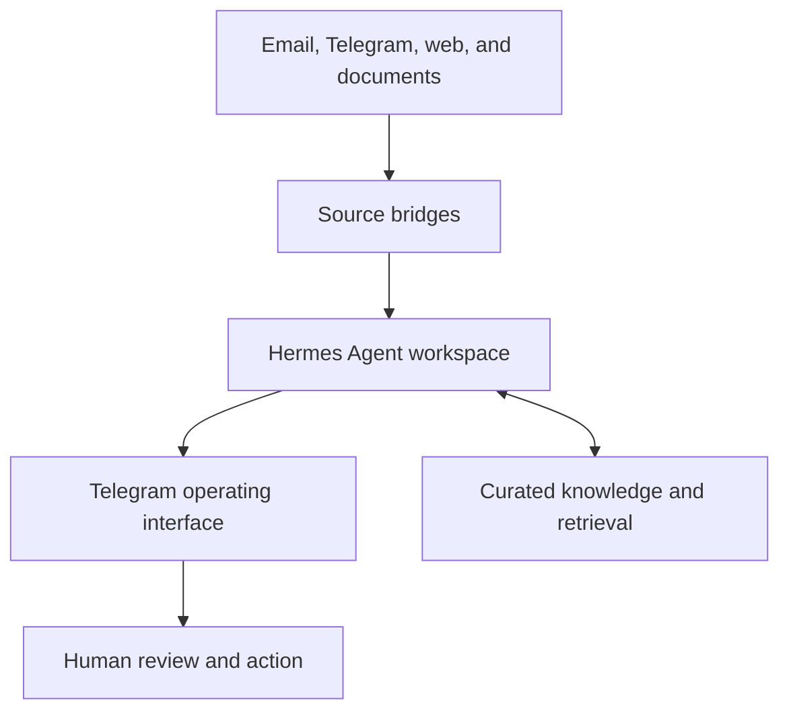

# Architecture

## Purpose

My AI Office is a personal operating system for information-heavy work. It collects selected inputs, creates structured context, and presents it through a single daily interface.

The purpose is not to automate judgment away. It is to reduce fragmented attention so that decisions can be made with better context and less repetitive work.

## System boundary

The public repository documents patterns that can be reproduced safely.

| Public | Private |
| --- | --- |
| Architecture, redacted configuration, integration patterns, generic agent prompts, and deployable code | Credentials, message histories, personal source lists, Telegram chat identifiers, documents, notes, and production endpoints |

## Target topology

### Components

| Component | Responsibility |
| --- | --- |
| **Source bridges** | Collect from approved inputs on a schedule or event, normalize data, and apply low-cost filtering before an agent is involved. |
| **Hermes Agent workspace** | Runs specialist agents, gives them tools and context, and applies workflow rules. |
| **Knowledge and retrieval** | Stores selected material with provenance, supports grounded recall, and keeps durable context separate from raw feeds. |
| **Telegram operating interface** | Delivers digests, alerts, approvals, questions, and work results where daily work already happens. |
| **Human review** | Owns decisions, external communication, irreversible actions, and the quality bar. |

## Agent roles

The system uses distinct roles so that each workflow has a clear input, output, and approval boundary.

| Agent | Input | Output | Human boundary |
| --- | --- | --- | --- |
| **Inbox Agent** | Selected mailboxes | Threaded summary and action list | The human sends, replies, or delegates |
| **Signal Agent** | Selected channels, feeds, and rules | Alert only when a meaningful signal is found | The human decides whether to act |
| **Digest Agent** | Channel and research feeds | Thematic briefing with source links | The human chooses what to read or use |
| **Knowledge Agent** | Saved messages, links, and notes | Curated artifact for retrieval | The human confirms what becomes durable knowledge |
| **Work Assistant** | Direct Telegram requests and retrieved context | Drafts, analysis, and prepared tasks | The human validates all consequential output |

## Daily information flow

1. A source bridge receives or polls an approved source.
2. It normalizes the content and applies deterministic filters such as source, topic, date, or priority.
3. A specialist agent classifies, summarizes, or enriches only the material that passes the filter.
4. The system stores selected material with a source reference when it is useful for later recall.
5. A concise result appears in the relevant Telegram topic: inbox, signals, digest, knowledge, or task.
6. A person reviews the result and decides whether anything should happen next.

This keeps inexpensive rules where rules are enough and reserves model calls for work that needs language understanding or synthesis.

## Hermes migration

The original private system used OpenClaw as its primary runtime. The migration moves the agent execution and workspace layer to [Hermes Agent](https://github.com/NousResearch/hermes-agent).

| Concern | Previous direction | Target direction |
| --- | --- | --- |
| Agent runtime | OpenClaw | Hermes Agent |
| Product identity | clawden-ai | My AI Office |
| Integrations | Purpose-built bridges | Preserve and adapt bridges as independent services |
| Model access | Routed across providers | Keep provider choice separate from agent workflows |
| Context and knowledge | Curated notes plus retrieval | Preserve provenance and retrieval patterns |
| Interface | Telegram topics | Telegram remains the daily operating surface |

The migration is intentionally incremental: establish the Hermes workspace first, then port each bridge with a redacted configuration and a reproducible test or example.

## Operating rules

- Do not commit tokens, certificates, cookies, personal data, message histories, or production connection details.
- Do not give agents unattended authority to send messages, publish content, trade, delete data, or change infrastructure.
- Record enough context to explain what an automation did and why it produced its result.
- Keep bridge services independently runnable so failures do not take down the whole system.
- Prefer source-backed summaries over unsupported assertions.

## Release approach

Each public component should include:

1. a short problem statement;
2. the input and output contract;
3. a redacted configuration example;
4. local run or test instructions; and
5. an explanation of its privacy and approval boundaries.

That makes this repository a useful reference for building personal agent workflows, rather than a dump of private operational configuration.
