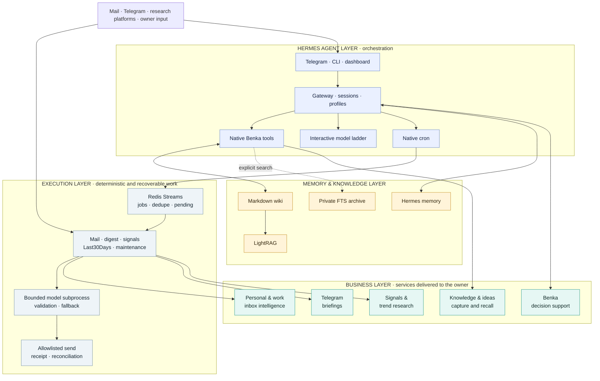
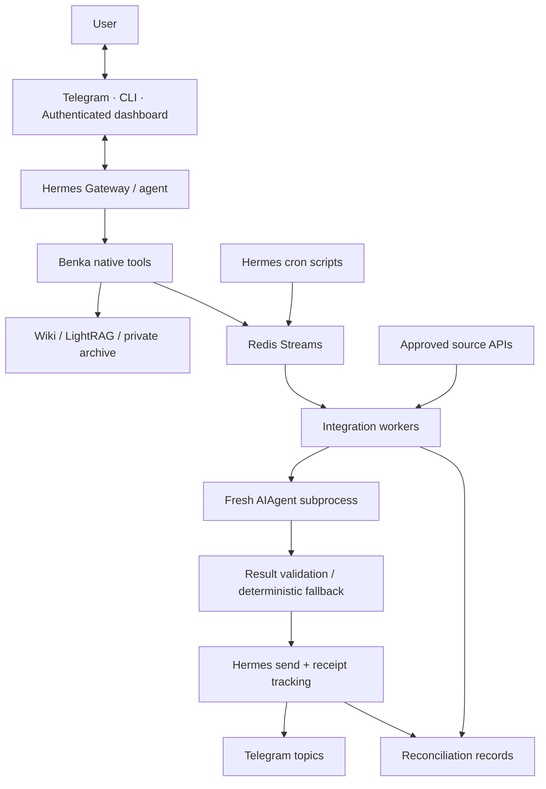

# Architecture

[Project overview](../README.md) · [Engineering case study](engineering-case-study.md) · [Operations](hermes/operations.md)

My AI Office connects a conversational assistant to durable background workflows. Hermes Agent supplies the runtime and interfaces; the `benka-integrations` package supplies the office-specific tools, adapters, queue handling, delivery controls, and migration logic.

The recorded production switch to Hermes took place on **6 September 2026**. The [cutover record](hermes/cutover-record-2026-09-06.md) and [acceptance record](hermes/acceptance.md) distinguish completed checks from open production acceptance. Earlier numbered OpenClaw documents describe the source deployment.

## Layered system view

The system is easier to assess when its business capabilities and technical responsibilities are separated:

| Layer | Question it answers | Components |
| --- | --- | --- |
| **Business** | What useful result reaches the owner? | Personal and work inbox intelligence, Telegram briefings, Signals, Last30Days research, Benka conversations, knowledge capture, idea promotion, grounded search, and historical recall. |
| **Hermes agent** | Who interprets intent and orchestrates the work? | Gateway, Telegram/CLI/dashboard interfaces, domain profiles, native Benka tools, interactive sessions, model selection, and native cron. |
| **Integration execution** | How is a source-specific job performed safely? | Redis Streams, dedicated Python workers, cursors, deterministic filters, isolated model calls, validation, delivery allowlists, receipts, and reconciliation. |
| **Memory and knowledge** | What survives and may be reused later? | Compact Hermes memory, an Obsidian-compatible Markdown wiki, LightRAG, a private conversation archive, and workflow-owned operational state. |
| **Infrastructure** | Where and under which boundary does it run? | Thirteen Docker Compose services on the private VPS, persistent volumes, internal networks, and a Caddy-protected dashboard. |

The business layer names the products of the system, not processes or containers. A briefing can depend on Hermes cron, Redis, a worker, a bounded model call, persistent state, and Telegram delivery while still appearing to the owner as one coherent office service.

## Business workflow catalog

| Workflow | Source boundary | Processing responsibility | User-facing result | Durable state |
| --- | --- | --- | --- | --- |
| Personal inbox | Personal AgentMail configuration | Poll, deduplicate, classify, and build mini-batches or scheduled summaries | Personal mail briefings and action items | Personal cursor, dedupe, run state, and delivery receipts |
| Work inbox | Separate work mailbox configuration | Resolve forwarded senders and preserve actionable/informational triage | Work-only briefings | Work cursor, dedupe, run state, and delivery receipts |
| Telegram Digest | Approved Telethon session, channel catalog, and folders | Read new posts, score, balance categories, remove repeats, render, and deliver | Source-linked scheduled digest | Source cursors, seen history, persisted release, and receipt |
| Signals | Enabled mail and Telegram rulesets | Evaluate frequent mini-batches and isolate source failures | Short alerts for configured matches | Ruleset state, locks, source references, and dedupe |
| Last30Days | Enabled research preset and external platform adapters | Run `Personal Feed` or `Platform Pulse`, combine surviving sources, and retain provenance | Cross-platform trend report | Per-source results, repeat history, run artifact, and receipt |
| Benka dialogue | Trusted Telegram route, CLI, or dashboard session | Select the domain profile, assemble allowed context, choose the interactive model tier, and expose scoped tools | Answer, critique, follow-up, or next-action support | Session state plus explicitly approved durable memory |
| Knowledge capture | Explicit save intent, forwarded content, URL, text, or approved server path | Normalize the source, create raw evidence and a wiki page, then enqueue selected pages for retrieval | Confirmed source-backed knowledge artifact | Raw evidence, wiki metadata, fingerprints, and indexing status |
| Ideas | Early thought, link, or fragment | Capture lightly; on explicit promotion enrich the same fingerprinted artifact chain | An idea that can mature without duplicate pages | Idea page, canonical identity, themes, and promotion history |
| Knowledge search | Question routed to the Knowledge surface | Search retrieval, open the strongest source pages, and compose only supportable claims | Grounded answer with human-readable references | Read-only query traces; source pages remain canonical |
| Archive search | Explicit request for historical recall | Query the private FTS index without attaching the full archive to the session | Excerpts with source and line provenance | Private imported archive outside Git |
| Maintenance | Daily and weekly Hermes cron actions | Report, archive, refresh topics/overview, and maintain selected LightRAG inputs | A usable knowledge system rather than an accumulating file dump | Maintenance job state and reports |

The [README business rhythm](../README.md#business-rhythm) lists the current production cadence. Exact source accounts, destinations, credentials, and enabled presets remain in private deployment manifests.

## Runtime boundaries

| Boundary | Responsibility | Source |
| --- | --- | --- |
| Hermes runtime | Agent execution, channel ingress, CLI, dashboard, native cron | [Pinned upstream](../vendor/hermes-agent) |
| Benka plugin | Seven office tools, wiki-first instructions, domain configuration | [plugin.py](../src/benka_integrations/plugin.py) |
| Integration workers | Source collection and deterministic processing around bounded model calls | [Package](../src/benka_integrations) · [Pipelines](../artifacts) |
| Redis | Job streams, slot deduplication, execution state, reconciliation, delivery receipts | [queue.py](../src/benka_integrations/queue.py) · [delivery.py](../src/benka_integrations/delivery.py) |
| Deployment | Separate services, networks, persistent mounts, resource limits, proxy configuration | [Compose and Docker files](../deploy/hermes) |

The agent runtime is containerized without the host Docker socket. Private deployment manifests bind source accounts, destinations, credentials, and domain paths. The public repository contains templates and code, not those bindings.

## Production topology

The production `benka-hermes` Compose project defines 13 services:

| Group | Compose services | Responsibility |
| --- | --- | --- |
| Agent access | `gateway`, `dashboard`, `caddy` | Telegram polling and profile routing; isolated browser UI; TLS/mTLS ingress. |
| State and knowledge | `redis`, `wiki`, `lightrag`, `omniroute` | Integration bus and receipts; durable wiki; graph retrieval; assigned provider routing. |
| Business workers | `worker-email-personal`, `worker-email-work`, `worker-telegram`, `worker-signals`, `worker-last30days`, `worker-maintenance` | Separate source processing, state, manifests, Redis groups, and delivery permissions. |

The `redis` service is the current **integration bus**. Hermes cron enqueues jobs into named streams; dedicated consumer groups process them; job status, confirmed delivery receipts, and reconciliation records remain in Redis. The inherited [`artifacts/integration-bus`](../artifacts/integration-bus) directory documents the predecessor's standalone Redis deployment and is not started as a second production bus.

External integrations are not containers. AgentMail, Telegram/Telethon, Reddit, Hacker News, GitHub, X, Bluesky, YouTube, Polymarket, and web discovery are source APIs or transports consumed by the relevant worker when enabled. Reddit's native JSON/RSS hybrid adapter is part of the Last30Days build under [`signals-bridge/last30days_patches`](../artifacts/signals-bridge/last30days_patches).

The VPS also hosts independent Compose projects: `reddit-compass`, `moex-futoi`, `cheap-intelligence`, and `stealth`. They share the host only. They are outside My AI Office's service graph, networks, state, and lifecycle commands. `reddit-compass` is therefore distinct from the external Reddit source used by Last30Days. See the [README service and source map](../README.md#services) and the [migration inventory](hermes/inventory.md#vps-hermes-и-соседние-проекты).

## Scheduling, execution, and delivery

Hermes cron owns application schedules after activation. Script jobs enqueue work into Redis and disable cron's automatic delivery; workers own processing and the shared delivery module owns publication.

1. The enqueue operation derives a stable run ID from the job and time slot. A Redis Lua operation checks the deduplication key and adds the job atomically.
2. A consumer group assigns work. Completed runs are acknowledged without repeating their work.
3. A worker processes the source data, validates any model-generated fields, and records the result.
4. Delivery reserves a fingerprint before calling `hermes send --json`, then saves confirmed message identifiers.
5. Recovered pending jobs and uncertain sends enter reconciliation. An operator must establish what happened before replaying consequential work.

This addresses duplicate scheduling and ambiguous delivery without claiming exactly-once effects across Redis and Telegram. The deduplication window is finite; explicit recovery still matters.

## Model execution

**Interactive assistant configuration and background integration routing are separate.** The main assistant uses the configured OpenAI route. Its dialogue, auxiliary, and delegation settings can select different models; this is configuration, not a universal automatic complexity classifier.

Background workflows use [models.py](../src/benka_integrations/models.py) and [model_child.py](../src/benka_integrations/model_child.py):

- Each call starts a fresh subprocess and temporary Hermes home, with tools disabled and personal memory, context files, and session persistence skipped.
- Explicit provider routes bound the fallback chain. Integration routes can differ from the main assistant and can use Qwen or DeepSeek first where configured.
- Iteration, token, and wall-clock limits constrain execution.
- Parsed output passes workflow-specific validation. When the model chain fails, the pipeline can return a deterministic fallback.

OmniRoute remains available for workloads assigned to it; it is not assumed to proxy every call. Model names and credentials are deployment configuration. Provider behavior and availability require live verification separately from fixture-based contract checks.

## Knowledge and context

| Store | Purpose | Boundary |
| --- | --- | --- |
| Markdown wiki | Durable, editable knowledge and idea chains, compatible with Obsidian | The primary knowledge store; records retain source metadata |
| LightRAG | Graph-assisted retrieval over selected knowledge | A search layer with its own indexing state and embedding requirements |
| Private SQLite FTS archive | Search over imported conversations and diaries | Historical material stays outside normal session context and outside Git |
| Hermes memory | Compact, persistent user facts and preferences | Selected durable context, not a copy of the full archive |

Wiki operations preserve fields such as `source_type`, `source`, `capture_mode`, and `promote_fingerprint`, and return artifact paths and RAG status. Captures and promotions retain provenance. The `обсуди:` convention requests discussion without automatic persistence, and whole mailboxes are not indexed by default.

Personal, work, family, and sandbox profiles receive separate configured domain bindings. Tool paths come from the deployment manifest rather than model-supplied paths. These controls need the routing and access checks in the acceptance matrix; profile names alone do not establish isolation. See the [plugin](../src/benka_integrations/plugin.py) and [wiki adapter](../src/benka_integrations/wiki.py).

## Interfaces and access

Telegram is the everyday conversational and briefing surface. CLI exposes operator and integration commands. A separate Hermes dashboard process sits behind Caddy with TLS/mTLS and application authentication.

The panel deployment uses a separate listener alongside existing VPS services. Its [runbook](hermes/panel.md) covers access, WebSocket behavior, and certificate operations; public documentation does not expose the production domain or credentials.

Source APIs and model providers are external dependencies. Persisting state on a private VPS does not make those requests local or eliminate provider-specific limits.

## Migration and recovery

The OpenClaw-to-Hermes migration preserves processing behavior and state contracts while replacing the runtime adapters. The tooling covers cold snapshot creation and verification, staged restore, a compatible OpenClaw import layout, archive indexing, and a three-way wiki comparison for rollback.

Deployment preparation and production activation are separate operations. Activation requires an explicit operator decision, a fresh consistent snapshot, and stopping the former writers. Rollback after new writes requires reconciling new artifacts, cursors, confirmed deliveries, and pending work before restarting old processors.

The [migration implementation](../src/benka_integrations/migration.py), [migration plan](hermes/migration-plan.md), and [cutover/rollback runbook](hermes/cutover-rollback.md) document the mechanics. The recorded switch retained the old state and stopped the former server's Docker services; observation and final acceptance are tracked separately.

## Verification boundary

Application builds and tests run on the VPS, using isolated containers and synthetic fixtures for rehearsal. The [acceptance record](hermes/acceptance.md) identifies the tested tree, container constraints, 209 regression results, native Hermes contracts, Redis recovery, and dashboard checks.

Those results establish specific behavior for the recorded candidate. They do not substitute for current provider authentication, a real Telegram conversation, full workflow acceptance, the observation period, or recovery verification after production writes.
