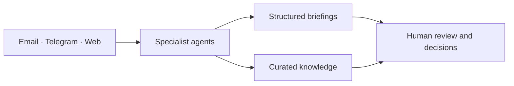

# My AI Office

> [!NOTE]
> **Archived — original concept.** This was the first public statement of the project, written
> before the Hermes implementation existed. Its migration statuses, repository layout, and
> "intended stack" describe that earlier stage and are no longer accurate.
>
> Current system: [README](../../README.md) · [architecture](../architecture.md) ·
> [acceptance record](../hermes/acceptance.md)

> **One person. Many agents.**

**My AI Office** is a self-hosted personal AI workspace that turns email, Telegram, research, and knowledge into a structured operating system for daily work.

It is an engineering case study in practical agentic automation: a small set of AI agents monitor information sources, prepare concise briefings, maintain a searchable knowledge base, and keep decisions and sensitive actions with the human.

[Architecture](../architecture.md) · [Migration status](#migration-status) · [Former OpenClaw edition](https://github.com/eiler2005/clawden-ai)

---

## What it does

Most AI setups are still chat windows: ask a question, get an answer, close the tab. My AI Office runs in the background and brings the relevant context to the right place before it is needed.

The operating loop is simple:



The system is designed around five everyday jobs:

| Agent | Role |
| --- | --- |
| **Inbox Agent** | Reads selected inboxes, groups related messages, and separates actionable items from reference material. |
| **Signal Agent** | Watches selected Telegram and web sources for high-signal events and sends only relevant alerts. |
| **Digest Agent** | Clusters information from Telegram channels into short thematic briefings. |
| **Knowledge Agent** | Turns selected messages, links, and notes into a curated knowledge base with grounded retrieval. |
| **Work Assistant** | Uses the accumulated context in Telegram to answer questions, prepare drafts, and help move work forward. |

## Built with agents, powered by Hermes

**My AI Office** is the project and portfolio name. [Hermes Agent](https://github.com/NousResearch/hermes-agent) is the agent runtime being adopted during the current migration.

Hermes provides the execution layer for tool-using agents and their workspaces. The surrounding office remains modular: source bridges, model providers, storage, retrieval, and delivery channels can evolve without changing the user-facing idea of the system.

The intended stack includes:

- **Hermes Agent** for agent execution and tool use
- **Python** and **Docker** for integration services
- **Telegram** as the daily operating interface
- **Redis Streams** for asynchronous jobs and events
- A curated **knowledge and retrieval layer** for durable context

## Migration status

The first private version of this system was developed as [clawden-ai](https://github.com/eiler2005/clawden-ai) on OpenClaw. This repository is its public continuation and migration path to Hermes Agent.

| Area | Status |
| --- | --- |
| System story, design, and public architecture | Published |
| Hermes-based agent workspace | In migration |
| Email, Telegram, and knowledge integrations | Being ported and redacted |
| Private data, credentials, real endpoints, and personal source lists | Intentionally excluded |

The private system is already used for daily work. This public repository will receive reproducible code, redacted configuration, architecture notes, and deployment patterns as each component is migrated.

## Design principles

- **Useful before impressive.** Every automation must save attention, improve a decision, or remove repetitive work.
- **Human approval for consequential actions.** Agents can prepare, recommend, and route; a person remains accountable for sending, publishing, or changing something important.
- **Private by design.** Credentials, message histories, personal notes, and source selections never belong in the public repository.
- **Observable workflows.** Each recurring job should leave an understandable trace: input, processing outcome, and delivered result.
- **Portable components.** The project is a reference implementation, not a monolith. Individual bridges and agents should be useful on their own.

## Repository structure

```text
.
├── docs/
│   └── architecture.md      # system boundaries, agent roles, and migration map
├── README.md                # project overview
├── LICENSE                  # MIT license
└── .gitignore               # secrets, runtime state, and local data stay out of Git
```

## Current scope

This is an early public release. The repository deliberately starts with the system narrative and boundaries, then adds components only after they can be shared safely and reproduced without private data.

## License

[MIT](../../LICENSE)
