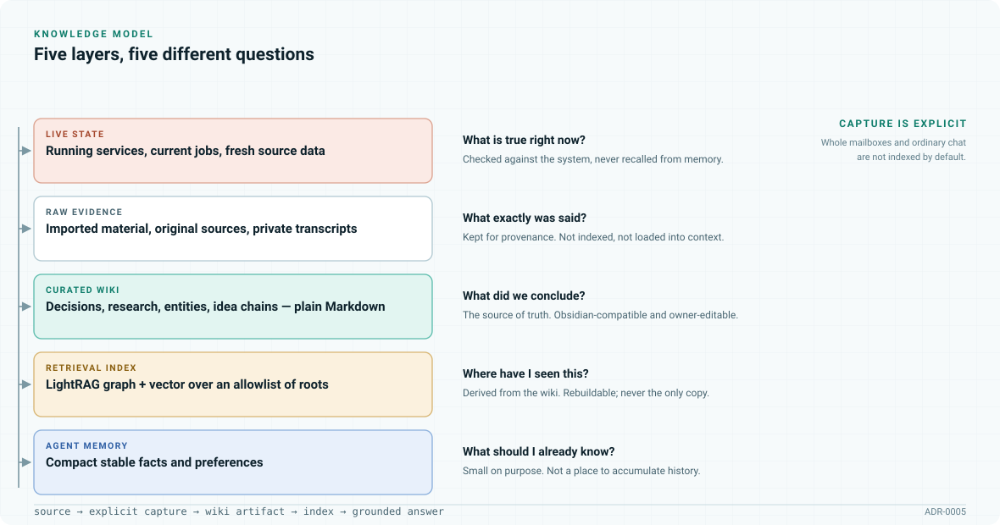
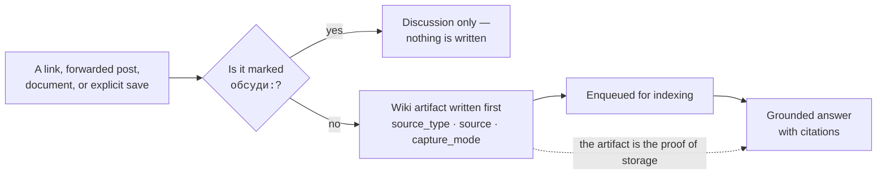

# Knowledge and memory

[Documentation map](README.md) · [Architecture](architecture.md) · [Workflows](workflows.md)

An assistant that remembers everything is an assistant nobody can audit. This document describes
what the office keeps, what it deliberately does not, and why the wiki — not the retrieval index —
is the thing that counts as storage.

## Five layers, five questions

<picture>
  <source media="(prefers-color-scheme: dark)" srcset="assets/memory-layers-dark.svg">
  
</picture>

| Layer | Question it answers | Why it is separate |
| --- | --- | --- |
| **Live state** | What is true right now? | Current-state questions are checked against running services, never recalled from memory. A remembered port number is a wrong port number. |
| **Raw evidence** | What exactly was said? | Original sources and private transcripts, kept for provenance. Not indexed, not loaded into context. |
| **Curated wiki** | What did we conclude? | The durable source of truth. Plain Obsidian-compatible Markdown the owner can read and edit. |
| **Retrieval index** | Where have I seen this? | LightRAG graph and vector search over an allowlist of roots. **Derived** — rebuildable from the wiki, never the only copy. |
| **Agent memory** | What should I already know? | Compact stable facts and preferences, so a conversation starts usefully. Small on purpose. |

Conflating any two of these produces a specific bug. Treating the index as the store means "did you
save that?" has no checkable answer. Treating raw evidence as curated knowledge fills retrieval with
noise. Treating agent memory as an archive makes every session expensive.

## Capture is explicit

**The wiki page is written before anything is indexed.** If indexing later fails, the knowledge is
still there and the index can be rebuilt. The reverse is not recoverable, which is why the order is
fixed rather than convenient.

Two states are reported separately, and conflating them is the bug this prevents:

- *upload accepted* — the document reached the service
- *indexed* — it is actually findable

Only the second makes retrieval work.

### What is not captured

- Whole mailboxes. Full email bodies are not indexed by default.
- Ordinary Telegram conversation.
- `raw/articles/` and `raw/documents/` — stored in the vault, but **out** of retrieval until a
  curated import promotes them into a visible wiki page.
- Anything prefixed `обсуди:` ("discuss") — the escape hatch that makes automatic capture safe to
  have at all.

The trade is deliberate: things the owner does not save are genuinely not saved. A system that
sometimes saves, on criteria the owner cannot see, is worse than one that always needs a word.

## Ideas and promotion

The Ideas surface exists because good capture friction is bad idea friction. A half-formed thought
should cost nothing to keep.

So Ideas captures with **light curation** into `wiki/research/**`. Later, promotion **extends that
existing chain** rather than creating a second artifact — matched by `promote_fingerprint`, so
promoting an idea deepens it instead of duplicating it.

## Grounded search

A question in the knowledge surface runs hybrid retrieval over the allowlisted roots, **opens the
top references**, and only then composes an answer with citations and source links where provenance
exists.

Opening the references matters: an answer assembled from retrieval snippets alone reads plausibly
and is frequently wrong about detail. The citations are what make it checkable rather than
trustworthy-sounding.

## Historical recall

Imported conversations and diaries live in a private SQLite FTS archive, searched **only on an
explicit request**. Results come back as excerpts with their source and line number.

The archive is deliberately not part of ordinary context assembly — loading a lifetime of history
into every session is expensive and makes answers worse, not better. Each domain gets its own
archive.

## Structure

The wiki carries its own system files:

| File | Role |
| --- | --- |
| `CANONICALS.yaml` | Canonical slugs, aliases, themes |
| `SCHEMA.md` | Write rules |
| `TOPICS.md` | Thematic navigator |
| `OVERVIEW.md` | Cold-start summary |
| `INDEX.md` | Full catalog |
| `IMPORT-QUEUE.md` | Curated import state |
| `LOG.md` | Append-only operations log |

Artifacts carry `source_type`, `source`, `capture_mode`, and `promote_fingerprint`, and operations
return `wiki_page_paths`, `raw_path`, and `rag_status`. These field names were preserved across the
runtime migration precisely so the knowledge base did not have to be rebuilt.

## Maintenance

| Job | Schedule | Mode |
| --- | --- | --- |
| Wiki daily | 03:15 | `dry_run`, `report` |
| Wiki weekly | Sun 03:30 | `apply` — report, archive, refresh topics, refresh overview |
| Retrieval refresh | Every 30 min | Indexes the explicitly allowed roots only |

The daily job reports without changing anything; only the weekly job applies. Lifecycle changes to a
knowledge base should be reviewable before they happen.

## Constraints worth knowing

> [!IMPORTANT]
> The embedding model identity and its **3072** dimension are pinned. Repointing the graph at an
> incompatible model silently invalidates the index — the queries keep returning results, and the
> results stop being right.

`rag_source_root` and `rag_index_roots` are set explicitly; URL ingest is disabled by default;
`legacy_path_map` translates old absolute queue paths into the new root, and unknown paths and `..`
are rejected.

## Related

- [ADR-0005](adr/0005-wiki-first-capture-rag-as-retrieval.md) — the wiki-first decision and what it
  costs
- [Security](security.md) — provenance and domain isolation
- [Archived memory architecture](archive/openclaw/10-memory-architecture.md) — the three-layer
  design this grew from
- [Archived knowledge management](archive/openclaw/17-knowledge-management.md) — the original Ideas
  and Knowledgebase workflow
