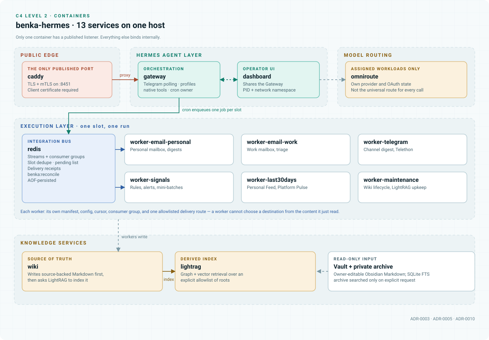

# Services reference

[Documentation map](../README.md) · [Architecture](../architecture.md) ·
[Operations](../hermes/operations.md)

The production `benka-hermes` Compose project defines **13 containers**. Names below match
[`deploy/hermes/compose.production.yaml`](../../deploy/hermes/compose.production.yaml), so the
public architecture can be compared directly against a runtime inventory.

<picture>
  <source media="(prefers-color-scheme: dark)" srcset="../assets/c4-container-dark.svg">
  
</picture>

## Edge

| Service | Role | Boundary |
| --- | --- | --- |
| `caddy` | TLS reverse proxy for the dashboard | **The only container with a published listener.** Terminates TLS on 8451 and applies mTLS before Hermes authentication. Keeps only `NET_BIND_SERVICE`. |

## Agent layer

| Service | Role | Boundary |
| --- | --- | --- |
| `gateway` | Hermes Gateway: Telegram polling, profile routing, native tools, interactive sessions, cron ownership | The **only** production Telegram polling owner. Mounts reviewed profiles, schedules, read-only vault data, and its own Hermes state. |
| `dashboard` | Hermes browser UI | Shares the Gateway's PID and network namespace — Hermes requires this for live status — but runs as a distinct process behind Caddy. |

## Execution layer

| Service | Role | Boundary |
| --- | --- | --- |
| `redis` | Integration bus: streams, consumer groups, slot dedupe, job state, delivery receipts, reconciliation | Persistent AOF-backed internal service. It schedules and records work; it never publishes to Telegram itself. |
| `worker-email-personal` | Personal mailbox polling, classification, dedupe, digest generation | Own manifest, config, cursor, consumer group, and delivery allowlist. |
| `worker-email-work` | Work mailbox polling, forwarded-sender resolution, triage, digests | Isolated from the personal mailbox by manifest, config, state, stream, and consumer group. |
| `worker-telegram` | Telethon channel reading, scoring, dedupe, digest rendering, persistence, delivery | Uses the approved channel catalog and a private Telethon session. Deliveries require confirmed receipts. |
| `worker-signals` | Rule-based monitoring of configured mail and Telegram sources | Frequent small checks; publishes only matched, configured signals. |
| `worker-last30days` | Personal Feed and Platform Pulse research | Shares the Signals codebase with independent jobs and state. Source failures are recorded per source. |
| `worker-maintenance` | Wiki lifecycle and LightRAG maintenance | Receives only maintenance operations and the mounts those need. |

## Knowledge services

| Service | Role | Boundary |
| --- | --- | --- |
| `wiki` | Wiki ingestion and query | Writes source-backed Markdown **first**, then asks LightRAG to index selected artifacts. |
| `lightrag` | Graph-assisted retrieval | Reads the approved vault input; keeps independent graph, vector, and KV state. Embedding identity and dimension 3072 are pinned. |

## Model routing

| Service | Role | Boundary |
| --- | --- | --- |
| `omniroute` | Provider routing for explicitly assigned workloads | Keeps separate provider and OAuth state. **Not** the universal route for every Hermes call. |

## Common constraints

Every runtime service: read-only root filesystem, dropped Linux capabilities, resource and PID
limits, controlled writable mounts, rotated logs, and **no Docker socket**.

Ownership is intentionally not uniform — Redis writes its AOF as UID/GID 999, OmniRoute writes
SQLite as root, and Caddy reads the mTLS key through the root group.

> [!WARNING]
> Never apply `chown -R` across production state. After the finalizer runs, ownership may be reset
> only for `state/runtime`, `private/activation`, `private/manifests`, and `private/bridges`.

Each send-capable worker also needs private `/state/uploads` and `/state/worker-logs` directories.
These are created during production preparation, because a read-only image cannot create them after
the bind mount — a missing one was a real cause of failed deliveries.

## Where the integration bus lives

There is no container named `integration-bus`. The bus is `redis` plus the scheduling, queue,
delivery, and worker contracts in [`src/benka_integrations`](../../src/benka_integrations):

```text
Hermes cron
  └─► Redis Streams
       ├─► ingest:jobs:email:personal ─► worker-email-personal
       ├─► ingest:jobs:email:work     ─► worker-email-work
       ├─► ingest:jobs:telegram       ─► worker-telegram
       ├─► ingest:jobs:signals        ─► worker-signals
       ├─► ingest:jobs:last30days     ─► worker-last30days
       └─► benka:maintenance:personal ─► worker-maintenance

Confirmed work  ─► job state / delivery receipt
Unknown outcome ─► benka:reconcile ─► operator review
```

[`artifacts/integration-bus`](../../artifacts/integration-bus) preserves the predecessor's
standalone Redis Compose artifact for history and migration compatibility. Production owns Redis
through `compose.production.yaml`, so starting that historical artifact would create a second
competing state plane.

## Not part of this system

| Layer | Systems | What it means |
| --- | --- | --- |
| **External source integrations** | AgentMail mailboxes, selected Telegram channels, Reddit, Hacker News, GitHub, X, Bluesky, YouTube, Polymarket, web results | Remote data sources a worker uses when enabled in its private configuration. Not local containers. |
| **Neighbouring VPS projects** | `reddit-compass`, `moex-futoi`, `cheap-intelligence`, `stealth` | Independent Compose projects sharing the host. Neither dependencies nor workers. Outside this system's networks and lifecycle commands. |

## Source implementations

| Source family | Consuming workflow | Implementation |
| --- | --- | --- |
| Personal and work mail | Polling, triage, scheduled digests | [`artifacts/agentmail-email`](../../artifacts/agentmail-email) |
| Selected Telegram channels | Telegram Digest | [`artifacts/telethon-digest`](../../artifacts/telethon-digest) |
| Mail and Telegram event sources | Signals rules and mini-batches | [`artifacts/signals-bridge`](../../artifacts/signals-bridge) |
| Reddit | Last30Days native JSON/RSS hybrid path | [`reddit_hybrid.py`](../../artifacts/signals-bridge/last30days_patches/reddit_hybrid.py) |
| Hacker News | Last30Days companion discovery via the public Algolia API | [`last30days_runner.py`](../../artifacts/signals-bridge/last30days_runner.py) |
| GitHub, X, Bluesky, YouTube, Polymarket, web | Last30Days source bundle, per private preset and credentials | [`config.example.json`](../../artifacts/signals-bridge/config.example.json) |
