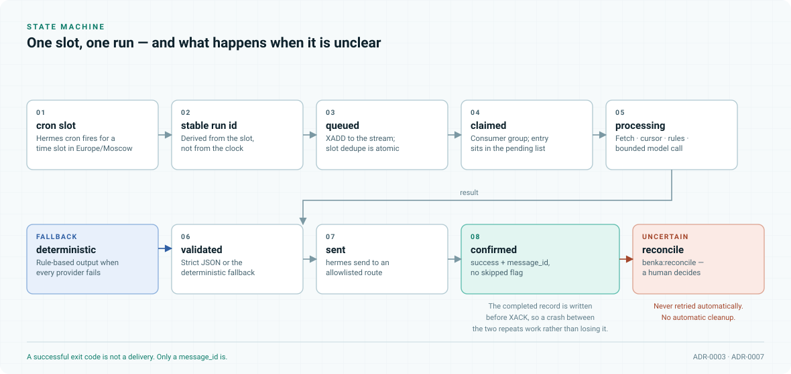
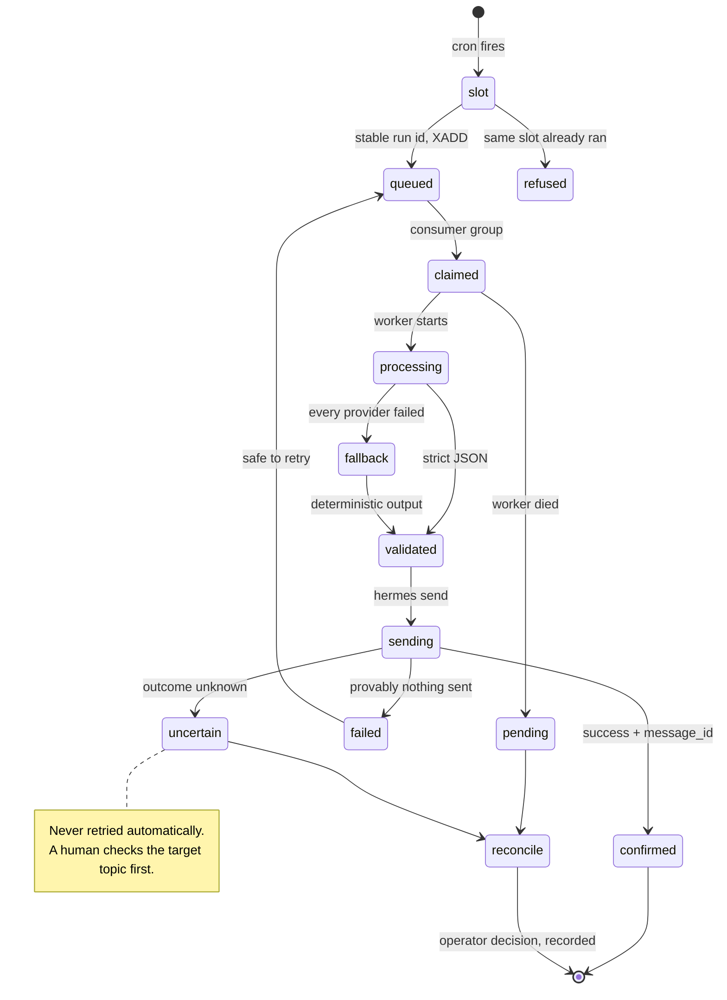

# Reliability

[Documentation map](README.md) · [Workflows](workflows.md) ·
[Operations](hermes/operations.md)

The office publishes to a real person's phone on a schedule. Two failures matter more than any
other: sending the same briefing twice, and losing one silently. Everything here exists to make
those two outcomes rare and, when they do happen, visible.

The design assumption is not that failures are rare. It is that **a job will be interrupted at the
worst possible moment**, and that the system must still be able to say what happened.

## The lifecycle

<picture>
  <source media="(prefers-color-scheme: dark)" srcset="assets/job-lifecycle-dark.svg">
  
</picture>

## The four mechanisms

### 1. Slot identity — one slot, one run

A cron slot derives a **stable run identifier** from the slot itself, not from the current time. The
identifier is deduplicated atomically in Redis before any work begins.

This is what makes a restart safe. A container that comes back up and finds its schedule has a
missed slot does not get to decide whether to run it; the dedupe key answers that. It also means a
manual trigger for a slot that already ran is refused rather than duplicated.

### 2. The pending list — interrupted work stays visible

A job claimed through a consumer group enters Redis's pending entries list and stays there until it
is acknowledged. A worker that dies mid-job leaves its entry behind.

That entry is the difference between "the digest didn't arrive and nobody knows why" and "run
`a1b2c3` was claimed at 17:00 and never completed". Recovered pending entries go to
`benka:reconcile` carrying their original payload, so the operator sees exactly what the worker was
holding.

The completed record is written **before** `XACK`. A crash between those two operations leaves a job
that will be re-processed — the safe direction, because the delivery step has its own duplicate
protection.

### 3. Receipts — a delivery is only what Telegram confirmed

| State | Condition | What happens |
| --- | --- | --- |
| `confirmed` | Response carries `success` and a `message_id`, no `skipped` | Receipt stored, cursor advances |
| `failed` | Provably nothing was sent | Safe to retry automatically |
| `uncertain` | The outcome cannot be determined | To `benka:reconcile`. Nothing automatic. |

**A successful exit code is not a delivery.** This is stated in the code, in the runbook, and here,
because it is the assumption that produces duplicates when it goes unexamined: the process exited
zero, therefore the message was sent.

### 4. Reconciliation — uncertainty is a state, not an error

`benka:reconcile` is where anything ambiguous waits for a person. The operator checks the target
Telegram topic, the stored artifacts, the cursors, and the pending entries, then records a decision
in the private operations log.

Recovery is deliberately narrow. For a confirmed single miss, the operator may enqueue a
**source-scoped job** carrying `source_id` and `target_message_id`. It reads only that one item and
runs the normal matching, dedupe, receipt, and delivery path — it is not a replay of the backlog.
Such a job is refused without `source_id`, so it cannot be widened by accident.

> [!WARNING]
> Blindly restarting with a new `run_id` bypasses slot dedupe and can create a duplicate. It is the
> one recovery action that must never be taken without checking the target first.

## What this has actually caught

Three production incidents, all on 2026-09-06, recorded in the
[acceptance record](hermes/acceptance.md):

| Incident | Cause | How the design behaved |
| --- | --- | --- |
| 17:00 MSK Telegram Digest missing | The worker could not find `hermes send` on its `PATH` | Failed **before** a `message_id`, stored `uncertain`, nothing resent. History check confirmed no message existed; one controlled run produced the release; an independent re-check found both parts. |
| Mail digests and Signals missing | Stale runtime image, schedule preparation reading only inline Signals rules, and missing writable worker directories | Three separate causes were separated rather than guessed at. Catch-up releases ran after a confirmed source check. |
| One confirmed Signals miss | The above | Recovered with a source-scoped job: one post, normal matching, confirmed receipts, no replay. The original `uncertain` receipts were kept for manual review rather than resent. |

In each case the fix touched **one service**. `worker-telegram` and `worker-signals` were recreated
with Compose `--no-deps`; the Gateway, `wiki`, and the neighbouring services were not restarted.

That is the practical payoff of the isolation in
[ADR-0004](adr/0004-separate-orchestration-from-domain-logic.md): a delivery bug in one worker is a
one-service deployment, not an outage.

## Verified behaviour

From the [VPS acceptance run](hermes/acceptance.md), against real Redis in an isolated network:

- After an AOF-backed container restart, the slot, the delivery receipt, and the pending entry all
  survived.
- The pending entry went to reconciliation. **No message was re-sent.**
- Queue and delivery tests cover slot dedupe, pending reconciliation, confirmed message IDs, and the
  prohibition on repeating an uncertain send.
- Snapshot tests cover whole-archive and per-file SHAs, tampering, path traversal, repeated import,
  an interrupted restore, and the absence of overwrites.

None of this replaces a real Telegram smoke test, and the acceptance record says so.

## What this costs

**Reconciliation is manual and permanent.** `benka:reconcile` has no automatic cleanup, so it is a
queue a human must actually watch. Monitoring the worker process is not enough — queue **age** and
**depth** are the signals that matter, because a healthy process with a growing backlog is the
failure this design surfaces.

**Recovery requires judgment.** There is no button that fixes a missed digest; there is a procedure
that checks first. That is slower, and it is why the office has never sent the same briefing twice.

## Related

- [ADR-0003](adr/0003-redis-streams-as-the-integration-bus.md) — why Redis Streams rather than a
  task framework
- [ADR-0007](adr/0007-delivery-receipts-over-blind-retry.md) — the receipt decision, with the
  alternatives
- [Operations — schedules and queues](hermes/operations.md#schedules-and-queues) — the operator
  procedures
