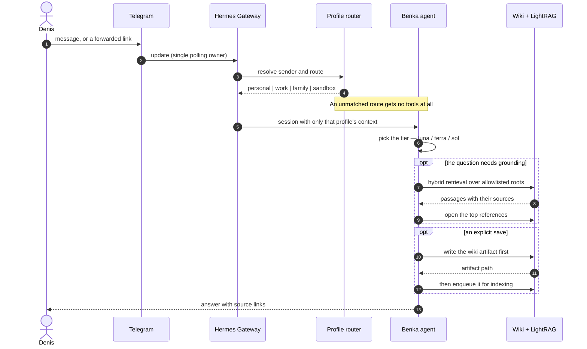

# Workflows

[Documentation map](README.md) · [Architecture](architecture.md) · [Reliability](reliability.md) ·
[Knowledge](knowledge.md)

Every piece of work in the office takes one of two paths. This document traces both end to end, then
catalogues the workflows that run on each.

## The two paths

**Interactive** work starts with a person. The owner asks something, forwards a link, or answers a
question, and expects a reply in the same conversation. It is synchronous, it uses the model ladder,
and it has access to the knowledge base.

**Background** work starts with a clock. Nobody is waiting, the output goes to a configured
destination, and the run has to be correct even if the process dies halfway through.

They share almost nothing: different entry points, different model policy, different tools,
different failure handling. Keeping them separate is what allows the background path to be strict
without making the conversation feel bureaucratic.

## Interactive path



Three things in that diagram are deliberate rather than incidental.

**Routing happens before tools.** The profile is resolved from the sender and route, and only then
is a session assembled. A `work` message cannot reach `personal` memory, because the context it
would need was never assembled.

**Retrieval opens its sources.** A grounded answer cites what it read, so the owner can check it
rather than trust it.

**A save writes the file before it indexes it.** The wiki artifact is the proof of storage;
indexing is a second step that can fail without losing the knowledge
([ADR-0005](adr/0005-wiki-first-capture-rag-as-retrieval.md)).

The `обсуди:` ("discuss") prefix keeps a message in conversation and prevents it from being captured
— the escape hatch that makes automatic saving safe to have at all.

## Background path

```mermaid
sequenceDiagram
    autonumber
    participant Cron as Hermes cron
    participant R as Redis Streams
    participant W as Dedicated worker
    participant Src as External source
    participant M as Bounded model call
    participant TG as Telegram

    Cron->>Cron: slot fires (Europe/Moscow)
    Cron->>R: XADD one job with a stable run id
    Note over R: slot dedupe is atomic —<br/>a repeat of the same slot is refused

    R->>W: consumer group delivers; entry enters the pending list
    W->>Src: fetch from the cursor
    Src-->>W: raw items
    W->>W: deterministic rules, dedupe, scoring

    alt language judgment helps
        W->>M: fresh home, no tools, no memory, bounded
        M-->>W: strict JSON, validated
    else every provider failed
        W->>W: deterministic fallback output
    end

    W->>W: persist the artifact, advance the cursor
    W->>TG: hermes send to the allowlisted route

    alt Telegram returns a message_id
        TG-->>W: success + message_id
        W->>R: write the completed record, then XACK
    else outcome unknown
        W->>R: benka:reconcile — a human decides
        Note over R: never retried automatically
    end
```

The ordering at the end matters: the completed record is written **before** `XACK`, so a crash
between the two leaves work that can be redone rather than work that silently vanished.

The full state machine, including what an operator does with a reconciliation entry, is in
[reliability](reliability.md).

## Workflow catalogue

| Workflow | Trigger | What it does | Where it lands |
| --- | --- | --- | --- |
| **Benka conversation** | Any trusted owner message | Routed session with the profile's context, tools, and model tier | The same conversation |
| **Personal inbox** | Poll every 5 min; digests at 08, 13, 16, 20 | Deduplicated mini-batches, then morning / interval / editorial summaries | `inbox-email` |
| **Work inbox** | Poll every 5 min; 8 slots, 08:30–19:00 | Resolves the original sender inside forwarded mail; splits actionable from informational | `work-email` |
| **Telegram Digest** | 08, 11, 14, 17, 21 | Reads the approved channel catalog, scores, dedupes, balances categories, renders with source links | `telegram-digest` |
| **Signals** | Every 5 min | Deterministic rules over configured mail and Telegram sources; a model runs only when a rule fires | `signals` |
| **Last30Days** | 07:00 | `Personal Feed` or `Platform Pulse` across Reddit, HN, GitHub, X, Bluesky, YouTube, Polymarket, web | `last30daysTrend` |
| **Knowledge capture** | An explicit save or a forwarded link | Source-backed wiki artifact, then indexing | Wiki, then the retrieval index |
| **Ideas** | A forwarded thought or fragment | Light capture now; promotion later extends the same chain instead of duplicating it | Wiki |
| **Grounded search** | A question in the knowledge surface | Retrieval, opens the top references, answers with citations | The same conversation |
| **LightRAG refresh** | Every 30 min | Indexes the explicitly allowed roots only | Retrieval index |
| **Wiki maintenance** | Daily 05:45 · weekly Sun 06:15 | Daily reports in dry-run; weekly applies report, archive, topic and overview refresh | Wiki |

The private deployment manifest remains the operational source of truth for which jobs are actually
enabled and at what minute. This table is the shape, not the switch.

## Why one failed source does not fail the run

Last30Days queries eight themes across seven platforms. On any given morning at least one of them is
rate-limited, blocked, or returning nothing.

Each source is therefore isolated: a failure is recorded per source, in
`errors_by_source`, and the run continues with what it has. `source_counts` reports what actually
came back. A digest built from six sources instead of seven is still worth reading; no digest at all
is not.

The same reasoning applies to the model. A workflow whose provider chain is exhausted uses its
deterministic path — rule-based titles rather than generated ones — instead of dropping the release.

## Related

- [Reliability](reliability.md) — slot identity, receipts, and reconciliation in full
- [Knowledge](knowledge.md) — what capture and grounded search actually write
- [Schedules reference](reference/schedules.md) — every slot in one table
- [ADR-0004](adr/0004-separate-orchestration-from-domain-logic.md) — why the domain logic is not in
  the prompt
- [ADR-0006](adr/0006-bound-background-model-work.md) — why background model calls are bounded
